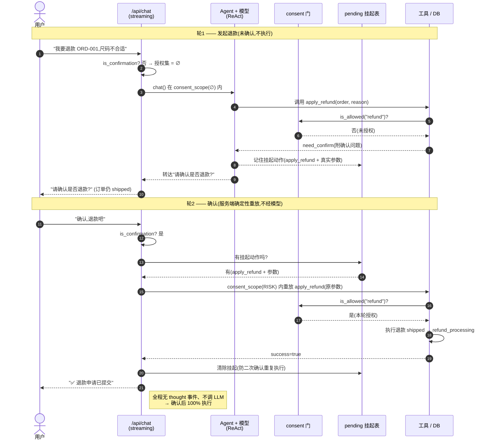

# nanobot 借鉴 · 优化执行方案（Master Plan）

> 本文是可直接照做的**执行方案**,把两份分析文档
> ([可改进点](借鉴nanobot-可改进点.md) / [详细分析与落地方案](nanobot借鉴-详细分析与落地方案.md))
> 的结论转成分阶段、带文件/接口/任务/验收/回滚的实施计划。
> 代码基线:分支 `feature/w1-service-streaming`(已含 W1–W4 + 议价 bargain + React 单页四合一 + 120+ 测试)。
> 每个阶段建议走本项目既有流程 `brainstorming → writing-plans → subagent-driven-development`(TDD + 逐任务双审 + 端到端冒烟)。

---

## 0. 当前基线核对(2026-07-21,合并后)

| 事实 | 结论 |
|------|------|
| `OpenAI(...)` 构造点 | 5 处:`app/agent/chat.py`、`app/multi_agent/orchestrator.py`、`app/agent/rag/embedder.py`、`app/evaluation/run_service.py`、`app/scripts/run_eval.py` |
| LLM 客户端复用关系 | `memory / summarizer / extraction / router` 均**复用传入的 client**——只要 chat/orchestrator 的 client 换成容错版,子调用自动继承 |
| 待建模块 | `app/resilience/`、`app/agent/consent.py`、`app/agent/history_utils.py` 均不存在 |
| chat.py 关键行 | `history_threshold`(:27)、`_react_loop`(:116)、`json.loads(tc.function.arguments)`(:154)、`_compress_history`(:247) |
| skills 解析 | `loader.py::_parse_frontmatter`(:35)手写正则,仅认扁平 `key: value` |
| 长期记忆 | `long_term.py::add_facts`(:85)= append + `lower()` 去重 + `[-max_facts:]` FIFO |
| 副作用工具 | `app/agent/tools/bargain.py`、`refund.py` 已存在,**执行前无消费门** |

---

## 1. 阶段总览与顺序

```
Phase 1  模型 fallback + 熔断          [P0·独立·最高可用性收益]  ← 先做
Phase 2  上下文防线三件套              [P0·独立·护 function-calling 循环]
Phase 3  风险动作前置授权门            [P1·贴合议价/退款涉钱场景]
Phase 4  鲁棒性阶梯(挑两条便宜的)     [P1·低成本减少可见报错]
Phase 5  记忆策展(借 prompt 不借基建) [P2·质量/成本优化]
Phase 6  治理链"观察 vs 授权"分离      [P2·架构优化,靠测试兜底]
Phase 7  小改进(Skill 解析 + 配置热更)[P3·顺手]
```

依赖关系:Phase 1–4 **互相独立**,可任意顺序/并行分支;Phase 3 与 Phase 6 有概念关联(授权门是 Phase 6 "授权"侧的具体落地),建议 3 先于 6。每个 Phase 结束都必须:**全量离线测试保持全绿 + 本阶段新增测试 + 服务启动冒烟**。

**不做**(见分析文档第五节):40+ provider 注册表、bwrap 沙箱、多渠道抽象、subagent 异步委派、FSM 状态机、mid-turn 注入、完整 Hook 类体系、SSRF(无外部调用面时)。

---

## Phase 1 — 模型 fallback + 熔断 + 错误分类重试  ⭐⭐⭐

**目标**:LLM 调用从"单点"变"主备双活":主模型瞬时错误(429/5xx/超时)自动重试,永久/可切换错误自动切备用模型,主模型连败触发熔断冷却。

**痛点**:5 处 `OpenAI()` 无重试/无 fallback/无熔断,主模型 429 即整条请求失败。

**新增/改动文件**
- 新增 `app/resilience/errors.py`:`classify_error(exc) -> "transient"|"switch"|"fatal"` + `retry_after_seconds(exc) -> float|None`。
- 新增 `app/resilience/breaker.py`:`CircuitBreaker(threshold=3, cooldown=60, now=time.time)`:`allow()/record_success()/record_failure()`。
- 新增 `app/resilience/llm_client.py`:`ResilientChatClient(primary, secondary, breaker, ...)` —— **透明代理**,暴露 `.chat.completions.create(**kw)` 与 `.beta.chat.completions.parse(**kw)`,其余属性 `__getattr__` 透传(与 W2 `TracingClient` 同款手法)。
- 新增 `app/resilience/factory.py`:`make_resilient_client() -> ResilientChatClient`(读 settings 建主备)。
- 改 `app/config/settings.py`:加 `fallback_base_url / fallback_model / fallback_api_key(可空,默认同主) / llm_timeout_s=120 / retry_backoff=(1,2,4) / breaker_threshold=3 / breaker_cooldown_s=60 / resilience_enabled=True`。
- 改 `app/agent/chat.py:18-21` 与 `app/multi_agent/orchestrator.py`:`self.client = make_resilient_client() if settings.resilience_enabled else OpenAI(...)`。**仅改构造点,不改 ReAct 逻辑**;memory/summarizer/extraction 因复用该 client 自动获容错。

**关键接口(供后续 writing-plans 定稿)**
```python
# errors.py
def classify_error(exc: Exception) -> str        # "transient" | "switch" | "fatal"
def retry_after_seconds(exc: Exception) -> float | None
# breaker.py
class CircuitBreaker:
    def allow(self) -> bool
    def record_success(self) -> None
    def record_failure(self) -> None
# llm_client.py
class ResilientChatClient:
    def __init__(self, primary, secondary, breaker, model, fallback_model,
                 backoff=(1,2,4), retry_after_cap=60): ...
    # .chat.completions.create(**kw) / .beta.chat.completions.parse(**kw) 透明代理
```

**任务拆解(TDD)**
1. `errors.classify_error` + `retry_after_seconds`:构造带 status_code / 文本的假异常,断言分类(429 拆速率限制=transient vs 欠费=switch;400/401/403/404/422=fatal;5xx/timeout=switch)。移植 `nanobot/providers/base.py:401-496,220-237,766-839`。
2. `CircuitBreaker`:注入假时钟,断言 3 连败跳闸、冷却内 `allow()==False`、冷却后半开放行。移植 `fallback_provider.py:108-115`。
3. `ResilientChatClient`:用 fake primary/secondary(可编程抛异常/返回),断言:瞬时错误按退避重试、遵守 Retry-After、可切换错误切 secondary、熔断打开直接走 secondary、fatal 直接抛。**全部离线,不连网络**。
4. `factory.make_resilient_client`:从 settings 建主备(secondary 缺省=复用主配置时退化为纯重试)。
5. 接入 chat.py / orchestrator.py 构造点;跑既有 `tests/test_emit.py`(离线构造 EcomAgent)确认无回归。
6. (可选)熔断命中数/fallback 命中率上报 W2:在 `create` 成功/切换时经现有 tracer 记一个 span 或计数,新增看板卡片。

**验收标准**
- [ ] 单测覆盖:分类 / 熔断 / 代理三层,全离线绿。
- [ ] 主模型注入 429 → 自动重试;注入欠费 → 切备用;备用成功返回。
- [ ] 主模型连败 3 次 → 熔断,后续直接走备用。
- [ ] `resilience_enabled=False` 时行为回退到原生 `OpenAI`(开关可关)。
- [ ] 全量离线测试仍全绿;`run_api.py` 起服务对话正常。

**风险与回滚**:透明代理若漏透传某属性会报 `AttributeError`——用 `__getattr__` 兜底(参照 TracingClient 的 `hasattr(real,'beta')` 防护)。开关 `resilience_enabled=False` 一键回退。
**工作量**:~1–1.5 人日。 **面试点**:"透明代理给 LLM 加错误分类重试 + 主备熔断,单点变双活。"

---

## Phase 2 — 上下文防线三件套  ⭐⭐⭐

**目标**:保护 function-calling 循环不被"单条大结果"撑爆、不被"悬空 tool_call"打成模型 400;压缩触发从"超 10 条"改为"按 token 预算"。

**痛点**(现状)
- `chat.py:91` 用 `len(raw_messages) > history_threshold(10)` 触发压缩:短对话过压、单条大结果失灵。
- `_compress_history:247` 只处理"起点是 tool 消息",没处理"assistant 带 tool_calls 但 tool 结果被裁掉"的非法态。
- tool 结果(整单 JSON / 长 RAG)无截断,直接进历史。

**新增/改动文件**
- 新增 `app/agent/history_utils.py`:
  - `estimate_tokens(messages) -> int`(粗估:字符数/一个系数,或用 tiktoken 若已依赖;先用字符估算)。
  - `legal_message_start(messages, start_idx) -> int`(把起点前移到合法 user 边界,不拆 tool_call/tool 对)。移植 `context_governance.py:437-446`。
  - `sanitize_tool_pairs(messages) -> list`(剥离畸形 tool_calls、丢弃悬空 tool 结果、回填缺失)。移植 `context_governance.py:176-296`。
  - `truncate_tool_result(text, limit) -> str`(超长截断 + 提示"结果过长已截断")。移植 `context_governance.py:109-136` 的思路(先不落盘,纯截断)。
- 改 `app/agent/tools/registry.py::execute_tool`(或 chat.py 追加 tool 消息处):对 `result_str` 调 `truncate_tool_result`。
- 改 `app/agent/chat.py`:`_compress_history` 用 token 预算触发 + `legal_message_start`;`_build_messages` 送模型前调 `sanitize_tool_pairs`。
- 改 `app/config/settings.py`:加 `context_window_tokens / max_output_tokens / context_safety_buffer=1024 / tool_result_max_chars=4000`。

**任务拆解(TDD)**
1. `truncate_tool_result`:超长截断、保留头部、加提示;短结果原样。→ 接入 execute_tool,测 tool 结果被截断。
2. `sanitize_tool_pairs`:构造"assistant 有 tool_calls 但缺对应 tool 消息""悬空 tool 消息"等非法序列,断言修复后合法(每个 tool_calls 都有配对 tool,反之亦然)。
3. `legal_message_start`:构造在 tool 中间的起点,断言前移到 user 边界。
4. `estimate_tokens` + 预算触发:把 `_compress_history` 触发条件改为 `estimate_tokens(build_messages()) > window - out - buffer`;测短对话不压、超预算才压。
5. `_build_messages` 末尾调 `sanitize_tool_pairs`;跑既有 conversation/react 相关的离线测试。

**验收标准**
- [ ] 单条超大 tool 结果被截断,历史不再爆窗。
- [ ] 构造"悬空 tool_call"序列 → 送模型前被自愈成合法序列(单测)。
- [ ] 压缩由 token 预算触发,短对话不再被过度压缩。
- [ ] 全量离线测试全绿。

**风险与回滚**:token 估算不准可能过早/过晚压缩——先用保守系数,后续可换 tiktoken。改动集中在 history_utils(纯函数,易测)+ chat.py 两处调用。
**工作量**:~1 人日。 **面试点**:"上下文防线:大结果截断 + token 预算压缩 + 裁剪协议自愈,防长对话把模型打成 400。"

---

## Phase 3 — 风险动作「前置授权门」  ⭐⭐⭐

**目标**:退款 / 大额让价 / 订单状态变更等**副作用工具在执行前**必须有授权(用户确认或坐席放行),默认拒绝;从"先斩后奏 + 事后转人工"变"事前门控"。

**痛点**:HITL 是回复后才判断转人工(`streaming.py`);`bargain.negotiate_price`、`refund.apply_refund` 由模型自行决定就执行,涉钱无前置确认。

**新增/改动文件**
- 新增 `app/agent/consent.py`(仿 `nanobot/agent/goal_permission.py`,~30 行):
  ```python
  _ALLOWED: ContextVar[frozenset[str]] = ContextVar("consent_allowed", default=frozenset())
  def is_allowed(action: str) -> bool
  @contextmanager
  def consent_scope(actions: frozenset[str]): ...   # 进入授权、退出复位
  ```
- 改 `app/agent/tools/refund.py` / `bargain.py`:执行前 `if not is_allowed("refund"/"deep_discount"): return {"success": False, "need_confirm": True, "message": "该操作需您确认…"}`。
- 改 `app/api/streaming.py` / `chat.py`:把"本轮已获授权的动作集合"通过 `consent_scope` 压入(来源:① 用户上一轮明确确认;② 坐席在 HITL 面板放行)。授权在动作边界强制、用后即撤。
- 可选:议价"深让价"阈值——`negotiate_price` 让价超过某比例才需授权(小让价免确认)。

**任务拆解(TDD)**
1. `consent.py`:测默认拒绝、`consent_scope` 内放行、退出复位、嵌套安全。
2. `refund.apply_refund`:未授权返回 `need_confirm`;授权(在 `consent_scope`)内正常执行改库。
3. `bargain.negotiate_price`:让价超阈值未授权 → `need_confirm`;小让价 → 直接成交。
4. 服务层:模拟"用户确认→本轮授权→再次调用成功"的两轮流程(用 fake agent)。

**验收标准**
- [ ] 未授权时退款/深让价返回"需确认",**不改库/不成交**。
- [ ] 授权后同一动作正常执行。
- [ ] 授权粒度到"动作类型",每轮生效、用后复位(单测验证不泄漏到下一轮)。

**风险与回滚**:授权来源(用户确认的判定)要清晰,避免误判导致正常流程被卡;可先只对 refund 上门控,议价随后。
**工作量**:~1 人日。 **面试点**:"仿 ContextVar 授权门做默认拒绝的前置确认,涉钱动作事前门控而非事后补救。"

---

## Phase 4 — 鲁棒性阶梯  ⭐⭐

**目标**:减少用户可见的"⚠️ 出错了",并让"确认后执行"变确定性。

### 4.0 服务端确认重放 ✅(已完成 2026-07-21)

**问题**:确认轮能否真正退款/成交,依赖模型"确认后再次调用同一工具"——这是 LLM 行为,存在偶发不调(端到端曾复现一次不执行)。consent 门只保证"未确认不执行",不保证"确认后必执行"。

**方案**:
- `app/agent/pending.py`(新):按 session 记住被门控拦下的挂起动作(工具名 + 模型当时的真实参数 + action)。
- `app/agent/chat.py::_react_loop`:工具返回 `need_confirm` 就 `observe_tool_result` 记住;同工具成功则清除(加法,不改核心分支)。
- `app/api/streaming.py`:用户说确认语且存在挂起动作 → `_replay_flow` 由服务端 `consent_scope(RISK_ACTIONS)` **直接重放该工具**,据真实返回拼确定性回复,**不再调模型**;重放后清挂起(防二次确认重复执行),并写回 Agent 历史保持上下文连贯。

**效果验证**:两轮 e2e——轮1 need_confirm(状态仍 shipped),轮2"确认,退款吧"事件流为 `tool_call→tool_result→reply`(**无 thought、不经 LLM**),状态 → refund_processing。与 consent 门互补:门保证不越权,重放保证必执行。
**测试**:`tests/test_pending.py`、`tests/test_streaming_replay.py`;全量离线 218 绿。

**两轮时序**:



- **轮1 关键**:consent 门默认拒绝 → 不越权;挂起表记下真实参数备用。
- **轮2 关键**:命中挂起 → 服务端**直接重放**,绕开模型是否重调工具的不确定性。

### 4.1 空回复重试 / 畸形工具调用降级 ✅(已完成 2026-07-21)

**改动文件**:`app/agent/chat.py::_react_loop`。抽出 `_llm_create`(统一带/不带 tools 调用)、`_answer_without_tools`(无工具兜底)、`_parse_tool_calls`(解析并判畸形)。
**两条**:
1. **空回复重试**:LLM 返回空/纯空白 `content` 且无 tool_calls → 不带 tools 重试一次;仍空则给兜底文案 `_EMPTY_REPLY_FALLBACK`,不把空白冒泡给用户。发 `degrade{reason:empty_reply}` 事件便于观测。
2. **畸形工具调用降级**:任一 `tc.function.arguments` 非法 JSON / 非对象 / 工具名缺失 → 整批降级为"不带 tools"的自然语言回答,**畸形调用绝不执行**,且不把带 tool_calls 的 assistant 写进历史(避免留下无结果的孤儿调用)。发 `degrade{reason:malformed_tool_call}`。

**测试**:`tests/test_react_degrade.py`(fake client 脚本化空/畸形/正常路径,断言重试次数、tools 开关、工具不被执行、历史干净)。全量离线 223 绿。

---

## Phase 5 — 记忆策展(借 prompt,不借基建)  ⭐⭐  ✅(已完成 2026-07-21)

**目标**:长期记忆从"追加+去重+FIFO 截 50"升级为"LLM 策展"(合并近义/就地纠正/按重要性淘汰),减少近义重复与重要事实被挤掉。

**痛点**:`long_term.py add_facts` 精确小写去重、`[-50:]` FIFO——近义重复留存、老而重要被新琐事挤掉。

**取舍(在线 + 保守 + 可降级)**
- **在线**而非离线 cron:本项目要"本地能跑",不引入调度基建;会话结束多一次 LLM 调用可接受,且有开关。
- **保守规则**而非放手让 LLM 乱改:只合并明显近义、明确矛盾才就地纠正、溢出按重要性(身份>稳定偏好>行为>未决问题)淘汰;不得杜撰。
- **默认关 + 失败降级**:`settings.memory_curation_enabled` 默认 False;LLM 异常/非法 JSON/空结果一律返回 None,降级回原 `add_facts`,绝不误清空记忆。离线测试因此不触网。

**已改动**
- `app/agent/memory/curation.py`(新):`curate_facts(client, model, existing, new, max_facts)` 一次 LLM 调用整理,命中原内容的事实保留其 `created_at`(不重置年龄),空结果→None。
- `app/prompts/memory.py`:新增 `LTM_CURATION_PROMPT`(合并/纠正/淘汰/不杜撰四条规则)。
- `app/agent/memory/long_term.py`:`extract_and_save` 抽出 `_merge_facts`——启用策展走 `curate_facts`,失败降级 `add_facts`。
- 接线:`LongTermMemory(curate_enabled=)` ← `MemoryManager(ltm_curation=)` ← `settings.memory_curation_enabled`。

**验收/测试**:`tests/test_memory_curation.py`——fake client 断言合并近义、保留年龄、按上限截断、去重、坏 JSON/异常/空结果降级、去代码围栏,以及 `extract_and_save` 三态(启用合并 / 失败降级 / 未启用朴素追加)。全量离线 234 绿。

**跳过(过度工程)**:git 版本化、dream-log、离线 cron 反思、Dream 文件编辑引擎——"每用户封顶 50 条"规模下不必要。

**巩固触发(真实客服场景,非手动)**:CLI 退出即 `agent.close()` 巩固;Web 无"会话结束"信号,用**空闲超时**近似——`SessionManager` 记录每会话最后活跃时间,后台守护线程(`start_reaper`)每 `reaper_interval`(默认 120s)扫一次,空闲超 `session_idle_ttl`(默认 1800s)的会话自动 `close()` 巩固并从内存回收;用户回来时按 session 文件重新装载。开关 `settings.auto_consolidate_enabled`(默认开),仅生产路径(未注入 manager)启线程,测试不受影响。`sweep(idle_ttl)` 用可注入时钟单测。前端"结束会话·巩固记忆"按钮 = 运维/演示用手动触发,免等 TTL。

---

## Phase 6 — 治理链"观察 vs 授权"分离  ⭐⭐(架构优化)  ✅(已完成 2026-07-22)

**已做(轻量版,未引入 hook 类体系,行为等价)**:
- `streaming.py`:抽出 `_finalize(text)->text` 输出护栏变换缝(消除 `_normal_flow`/`_replay_flow` 两处重复),并给 `_normal_flow` 加"授权闸门 / 观察变换"分段注释——授权在动作边界强制(consent_scope),观察(输出变换、事后升级)不否决已发生的动作。
- `chat.py`:工具执行从 `_react_loop` 内联抽出 `_execute_tool_call`(before 埋点→执行→after 埋点+挂起观察+写历史),得到干净的工具生命周期缝;埋点是"观察"、真正授权在工具内 consent 门。
- 验收:全量离线 263 绿 + 端到端冒烟(`thought→tool_call→tool_result→reply→metadata→done` 序列不变)。

---

### 原始设计说明

**目标**:把 `streaming.py` 里命令式揉在一起的治理链(限流→人工→快路径→成本→护栏→Agent→护栏→升级)理清为两类:**观察**(不能否决动作:可观测埋点、事后升级判定)与**授权**(在动作边界强制:限流/成本/人工短路/前置授权门)。

**关键判断(如实记录)**:对单循环小 bot,照搬 nanobot 完整 `AgentHook`/`CompositeHook`/工厂体系属**过度工程**。**只做轻量版**:
- 输出护栏做成一个 `finalize(text)->text` 变换回调(借 `hook.py:139 finalize_content` 思路)。
- 2–3 个工具生命周期回调(`before/after_execute_tool`)替换 `_react_loop` 内联 `_emit`,得到干净埋点缝。
- **暂不**引入完整 hook 类体系。

**改动文件**:`app/api/streaming.py`(治理链重排)、`app/agent/chat.py`(埋点缝)。
**前置**:建议在 Phase 1–4 稳定后做;有 120+ 测试兜底,重构风险可控。
**验收**:[ ] 行为等价(全量离线测试全绿 + 端到端冒烟);治理项之间解耦、可独立开关。
**工作量**:~1.5–2 人日。 **面试点**:"把'观察'与'授权'分离——观察不能否决动作,授权在动作边界强制。"

---

## Phase 7 — 小改进  ⭐  ✅(已完成 2026-07-22)

**7a. Skill frontmatter 解析健壮性 ✅**
- `app/agent/skills/loader.py::_parse_frontmatter`:手写正则 → `yaml.safe_load`,支持嵌套/列表/多行/引号;非法 YAML 或非映射一律返回 `{}`,坏 SKILL.md 被 `_discover` 跳过而非拖垮整个扫描。`_discover` 对 name/description 做 `str().strip()` 兜底。
- `requirements.txt` 加 `pyyaml>=6.0`(实际已随依赖传入 6.0.3)。
- 测试:`tests/test_skill_frontmatter.py`(扁平/嵌套/列表/多行/带冒号引号值/坏YAML/非映射/body 提取/坏 skill 跳过)。

**7b. 配置签名式热更新 ✅**
- `app/config/hot_reload.py`:`config_signature()` + `reload_settings(fresh=None)`——重读 .env,只更新白名单热更字段(`rate_limit_per_min`/`daily_request_budget`/`hitl_confidence_threshold`/`model_name`/`fallback_model`/`fallback_base_url`),返回变化字段名;`fresh` 可注入便于测试。
- `POST /api/config/reload`(admin):把变化应用到在运行的 `RateLimiter.max`/`CostGuard.max`/`HitlManager.confidence_threshold`;模型变更对新建会话即时生效。改 .env 后调一次即生效,免重启进程。不 watch 文件、由显式触发驱动。
- 测试:`tests/test_config_hot_reload.py`(签名覆盖/检测并应用/无变化空列表/端点应用到限流器)。

全量离线 263 绿(+13)。

---

## 3. 全局验收与回归(每个 Phase 通用)

1. **离线测试基线**:每个 Phase 完成后,`.venv/Scripts/python.exe -m pytest tests/ -q`(排除依赖真实 API 的 test_agent/test_rag/test_mcp/test_react_agent/test_multi_agent/test_memory/test_skills/test_evaluation/test_conversation_management)必须**全绿**,且本阶段新增测试通过。
2. **端到端冒烟**:`run_api.py` 起服务,聊 2–3 句(含一个会触发本阶段能力的场景),看行为正确。
3. **开关兜底**:每个新能力带 settings 开关,默认开、可关(便于对比与回滚)。
4. **提交规范**:每阶段独立特性分支或独立提交序列,commit 信息带阶段号;文档链接回本方案。

---

## 4. 推荐执行顺序(结合简历/面试价值)

| 顺序 | Phase | 理由 |
|------|-------|------|
| 1 | Phase 1 模型 fallback | 最独立、可用性收益最大、面试最好讲、复用 TracingClient 手法 |
| 2 | Phase 2 上下文防线 | 护 function-calling 循环,长对话稳定性 |
| 3 | Phase 3 前置授权门 | 贴合已有议价/退款涉钱场景,安全叙事强 |
| 4 | Phase 4 鲁棒性阶梯 | 便宜、直接改善体验 |
| 5 | Phase 5 记忆策展 | 质量/成本优化,想深化记忆线时做 |
| 6 | Phase 6 治理链分离 | 架构升华,放稳定后做 |
| 7 | Phase 7 小改进 | 顺手补 |

> 建议先做 **Phase 1 + 2 + 3**(约 3–4 人日),这三块把"可用性 / 长对话稳定性 / 涉钱安全"补齐,是最能体现"生产级"的组合,也最好写进简历/面试。

---

## 5. 每 Phase 的实现入口(照此开工)

对选定的 Phase:
1. `Skill(brainstorming)` 确认该 Phase 的范围与取舍(尤其 Phase 5/6 有设计空间)。
2. `Skill(writing-plans)` 基于本方案该 Phase 的"文件/接口/任务拆解"产出 bite-sized TDD 实现计划。
3. `Skill(subagent-driven-development)` 或本会话内直接执行:先写失败测试 → 最小实现 → 跑过 → 提交。
4. 完成后按第 3 节做全局验收 + 端到端冒烟,推送。

---

> 依据:两份分析文档 + 对当前分支代码的核对(见第 0 节)。nanobot 源码位置见《详细分析与落地方案》附录索引。本项目与 nanobot 均 MIT,借鉴做法/思路即可,保留必要出处。
