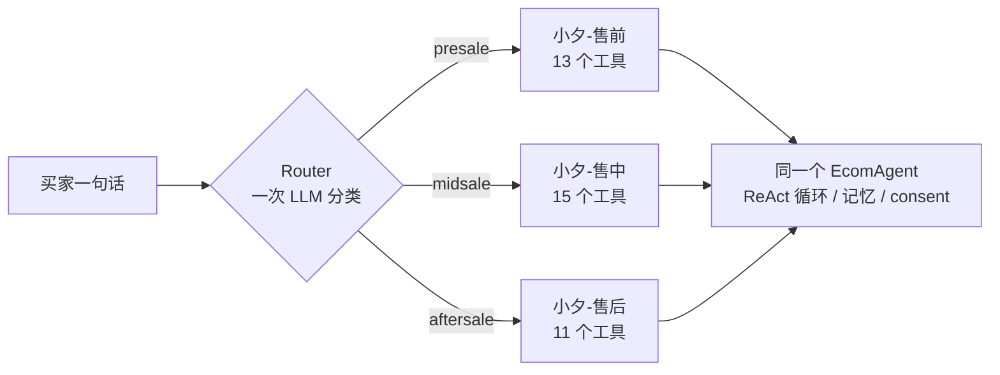
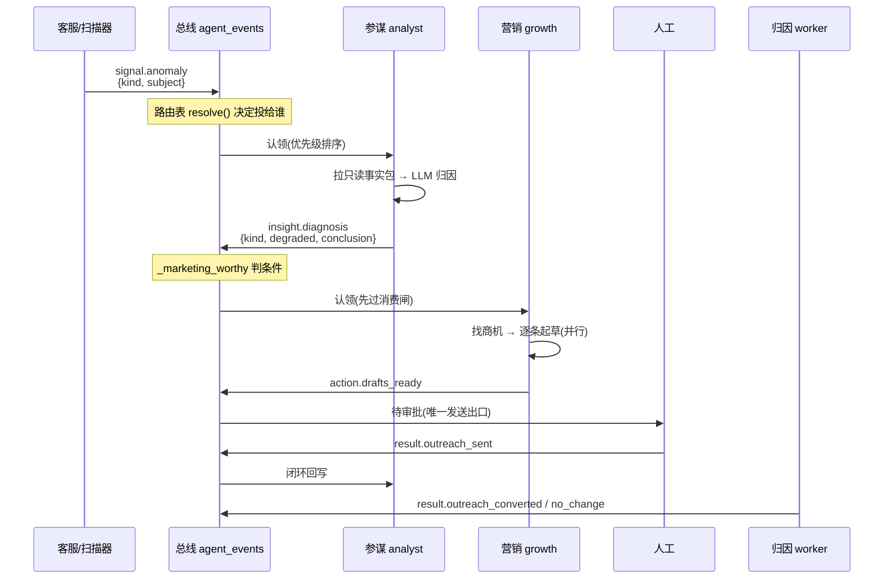
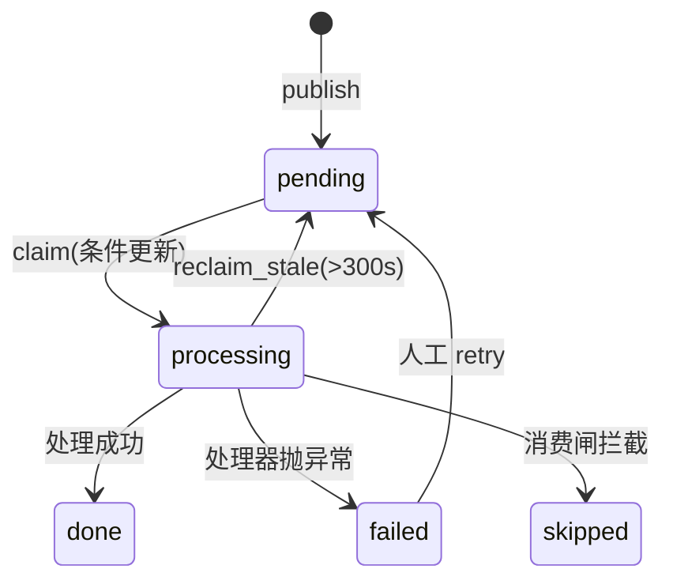

# 多智能体协作:技术文档

> 本文对应代码目录 `app/multi_agent/`(11 个模块,约 3200 行),外加
> `app/scripts/agent_collab.py`(worker)与 `app/agent/tools/{anomaly,growth}.py`
> (信号源与商机源)。所有结论都标了文件与行号,可以直接跳过去核对。

---

## 0. 先破一个误解:这里有**两套**完全不同的"多智能体"

看不懂这一块,最常见的原因是把两件事当成了一件。它们的运行时机、通信方式、
失败后果都不一样:

| | **会话内薄编排** | **后台事件驱动协作** |
|---|---|---|
| 什么时候跑 | 买家/店主每说一句话,同步 | 独立 worker 进程,异步轮询 |
| 参与者 | 5 个"画像"共享 **1 个**引擎 | 3 个 Expert(参谋/营销/人工闸) |
| 怎么通信 | 不通信——一轮只有一个画像在跑 | 持久化事件总线 |
| 谁决定下一步 | Router(一次 LLM 分类) | 路由表(纯函数,零 LLM) |
| 挂了会怎样 | 买家这一轮答不出来 | 买家无感,后台链停住 |
| 代码 | `orchestrator.py` / `router.py` / `agents.py` | `bus.py` / `routing.py` / `collab.py` |

**"多智能体协作"这个词在本项目里通常特指后面那套**(第 2 节起)。前面那套
严格说是"一个 Agent 换装",本文先用一节讲清,免得混淆。

---

## 1. 会话内薄编排:5 个画像,1 个引擎

### 1.1 形态

不是 N 个各自带一套 ReAct 循环的子 Agent,而是**同一个经过硬化的 `EcomAgent`**,
按路由结果切换**画像**(专属 system prompt + 工具子集)。

`app/multi_agent/orchestrator.py:1-7` 把理由写得很直白:复用全部硬化(空回复降级、
落盘指针、consent 门、事件流、记忆/持久化),延迟与成本低,**加一个新领域只是加一份画像**。



买家侧三个画像(`MultiAgentOrchestrator`),卖家侧两个(`SellerOrchestrator`,
`orchestrator.py:430`):

| 画像 | 标识 | 工具数 | 归属 |
|---|---|---|---|
| 小夕-售前 | `presale` | 13 | 买家侧 |
| 小夕-售中 | `midsale` | 15 | 买家侧 |
| 小夕-售后 | `aftersale` | 11 | 买家侧 |
| 参谋-小策 | `analyst` | 9(全只读) | 卖家侧 |
| 增长-小拓 | `growth` | 9(草稿型) | 卖家侧 |

### 1.2 工具子集就是能力边界

每个画像有**独立的 `ToolManager`**,只暴露该领域允许的工具
(`orchestrator.py:58-70`)。这不是为了整洁——它是硬边界:售前画像的工具表里
根本没有 `apply_refund`,所以无论提示词被怎么绕,它都调不出退款。

### 1.3 买卖隔离靠端点,不靠模型猜

`actor` 由**端点**决定(买家 `/api/chat`、店主 `/api/seller/chat`),
不让 LLM 判(`orchestrator.py:465-468`)。卖家侧 skill 只在 `ACTOR_SELLER` 下可见。

### 1.4 两个 Router 的差别

- 买家侧 `Router.route()` 可能判不出 domain → 有**粘性路由**(沿用上一轮,
  `orchestrator.py:56`);
- 卖家侧 `SellerRouter.route()` 返回值域恒为真值 → **刻意没有**回退链
  (`orchestrator.py:470-473` 明确写了为什么不该有)。

---

## 2. 后台协作:三个 Expert,一条总线

### 2.1 参与者与事件

**Agent 标识**(`bus.py:27-30`):

| 常量 | 值 | 角色 |
|---|---|---|
| `AGENT_SERVICE` | `service` | 客服(C 端,信号生产者) |
| `AGENT_ANALYST` | `analyst` | 店铺参谋(B 端,**只读**) |
| `AGENT_GROWTH` | `growth` | 营销增长(B 端,**只出草稿**) |
| `AGENT_HUMAN` | `human` | 人工闸——需要人看的事件投给它 |

**事件类型**(`bus.py:33-38`):

| 常量 | 值 | 谁发 |
|---|---|---|
| `EV_SIGNAL_ANOMALY` | `signal.anomaly` | 客服埋点 / 定时扫描 |
| `EV_INSIGHT_DIAGNOSIS` | `insight.diagnosis` | 参谋 |
| `EV_DRAFTS_READY` | `action.drafts_ready` | 营销 |
| `EV_OUTREACH_SENT` | `result.outreach_sent` | 人工审批端点 |
| `EV_OUTREACH_CONVERTED` / `_NO_CHANGE` | `result.outreach_*` | 归因 worker |

### 2.2 完整链路



**关键**:一次 `run_once()` 就能跑完 signal → diagnosis → drafts 整条链
(`collab.py:688-707`)——参谋段消费完会当场 publish,紧接着营销段消费就能看到。
再调一次只会看到队列已空,那是幂等,不是"还有下一段"。

### 2.3 三层分工

```
app/multi_agent/routing.py   编排语义:订阅表、优先级、消费闸
app/multi_agent/bus.py       对外门面:publish / consume / 时间线 / 重试
app/multi_agent/event_bus.py 载体实现:当前 SQLite,可换
```

`event_bus.py:1-28` 说明了为什么要抽第三层:改造前时间线、失败列表、手动重试、
滞留回收这四条路径**绕过门面直接操作事件表**,所以"换载体只改一个文件"这句话
对三个 Agent 是真的、对观测路径是假的。

---

## 3. 路由表:这块最值得看懂

### 3.1 它解决了什么

改造前发布方直接写 `publish(..., target=AGENT_GROWTH)`,而"什么诊断该转营销"
写死在参谋的代码里。三个后果(`routing.py:5-11`):

1. 加一个订阅同一信号的新 Agent,得改客服会话**热路径**——而那与新 Agent 无关;
2. `target_agent` 是单值,同一条信号**做不到同时给两个 Agent**;
3. "营销何时被唤醒"这条规则藏在参谋模块的常量里,**运营看不到**。

改造后发布方只宣布"发生了什么",**三个 Expert 之间没有任何一方在指挥另一方**。

### 3.2 数据结构

```python
@dataclass(frozen=True)
class Subscription:
    target: str                                  # 投给谁
    when: Optional[Callable[[dict], bool]] = None   # 条件谓词,None=无条件
    priority: "int | Callable[[dict], int]" = 0     # 常量或谓词
    reason: str = ""                             # 给人看的规则说明
```

`when` **必须是纯函数**(不读库、不调模型)——路由发生在发布那一刻,而发布点
之一在买家会话热路径上,任何 IO 都会变成买家那一轮的延迟(`routing.py:44-47`)。

### 3.3 当前订阅表(`routing.py:108-136`)

| 事件 | 投给 | 条件 | 优先级 |
|---|---|---|---|
| `signal.anomaly` | 参谋 | 无 | **动态**:转人工=紧急,其余=普通 |
| `insight.diagnosis` | 营销 | `_marketing_worthy` | 普通 |
| `action.drafts_ready` | 人工 | 无 | 普通 |
| `result.outreach_sent` | 参谋 | 无 | 普通 |
| `result.outreach_converted` | 人工 | 无 | 低 |
| `result.outreach_no_change` | 人工 | 无 | 低 |

**优先级只设三档**(`P_URGENT=10 / P_NORMAL=0 / P_LOW=-10`),不搞 0–100 连续值:
连续值会让每次新增订阅都要纠结"填 37 还是 42",而实际决策只有"更急/一般/可以等"。

**为什么优先级要支持谓词**:本项目所有异常都走同一个 `signal.anomaly` 事件类型,
"买家刚被转人工"与"例行退款率扫描"的区别在 payload 的 `kind` 里,**不在事件类型上**
——只支持常量就表达不了这个差异(`routing.py:49-52`)。

### 3.4 `_marketing_worthy`:唯一的条件订阅

两个条件(`routing.py:62-86`):

1. `kind` ∈ `{"refund_rate_high"}`。只有商品退款率跨线——它的下游动作(给受影响的
   滞留订单发触达)有明确因果;工具失败率、转人工率是**服务质量**问题,推销不解决它们。
2. `degraded` 的诊断**不转**。归因不可用时 `conclusion` 只剩"仅列事实、归因暂不可用",
   而 `_llm_draft` 会把它原文嵌进买家话术——半成品文案写给买家没有意义。
   人工审批挡得住"内容有没有问题",挡不住"这条消息压根不该被生成"。

### 3.5 扇出发生在**写入时**

路由表算出 N 个订阅者就插 N 行投递记录(同 `correlation_id`、同 payload、不同
`target_agent`),`bus.py:56-61` 解释了为什么不能"只存一行、消费时反查订阅":

> `status` 是行级单值,参谋处理完置 done,营销就再也捞不到了。

### 3.6 为什么是代码常量而不是配置表

`routing.py:20-23`:订阅条件是带业务语义的谓词(如"归因降级的诊断不转营销"),
不是能塞进 SQL 的标量比较;硬做成表就要发明一套条件 DSL。而这份表改动频率极低
(加 Agent 才动)。

> **"可配置"的价值在于集中且可见,不在于能热改。**

---

## 4. 两种拦截,方向相反——这是最容易看岔的地方

|  | **订阅条件 `when`** | **消费闸 `GATES`** |
|---|---|---|
| 何时判 | **发布**那一刻 | **消费**那一刻 |
| 能不能读库 | **不能**(热路径) | 能(worker 里) |
| 回答什么问题 | 这类事件该不该给这个 Agent | **此刻**这个 Agent 该不该动手 |
| 出错时 | **fail-closed**(不投递) | **fail-open**(放行) |

**失败方向相反不是自相矛盾**(`routing.py:163-166`):

- 订阅决定的是"要不要**凭空造出**一次 Agent 唤醒"——那是增量动作,判不清就不做;
- 闸决定的是"要不要**拦下**一件已经该做的事"——拦截是减量动作,判不清就别拦。

**为什么状态判断必须在消费侧**(`routing.py:190-193`):①发布点在热路径上,读库
会变成买家的延迟;②更要紧的是**状态在发布与消费之间会变**——事件可能在队列里躺了
整整一个 worker 间隔,发布时判等于拿过期状态做决定。

当前唯一的闸是 `_marketing_paused`:未结人工工单数超阈值时营销静默——
"一堆买家正等着人工处理"说明店铺当下的处境是先灭火,此时起草营销是明显的时机错误。
默认 `collab_marketing_pause_open_handoffs = 0` 即关闭。

---

## 5. 可靠性:幂等、恢复、失败隔离

### 5.1 幂等的根基是一条条件更新

`Database.claim_events`(`app/db/database.py:1255`):

```sql
UPDATE agent_events SET status='processing', consumed_at=?
 WHERE id = ? AND status = 'pending'
```

`rowcount == 0` 就是"已被别的 worker 认领"。docstring 写得很硬:

> 绝不能改成"先 SELECT 再 UPDATE"——那样同一条异常会产出两份洞察/两份草稿。

认领顺序:`ORDER BY priority DESC, id ASC`ーー**同优先级严格 FIFO**,乱序会让
"为什么这条比那条晚处理"变得无法解释。

### 5.2 状态机



`skipped` 是刻意的第三种终态(`bus.py:190-195`):

- 不是 `done`——它并没有被处理,记成 done 就是**账本撒谎**;
- 不是 `failed`——它没有出错,混进失败列表会**淹没真正的故障**。

### 5.3 失败不自动重试

单条处理器抛异常只把**那一条**置 failed,不影响同批其它事件。**failed 不会被自动
重试**(避免坏事件无限循环),留在表里供人工在时间线上看到并决定
(`bus.py:158-163`)。所以 `bus.failed()` / `bus.retry()` 这两个出口是必需的——
没有它们,"留给人工决定"等于留给没人。

### 5.4 收尾本身也会失败

`_finish_and_count`(`bus.py:112-151`)按**实际落库结果**计数,而不是按"处理器跑完了":

- 抛异常(锁表/磁盘满)→ 计入 `persist_failed`;
- 返回 False(该行已不在 processing,大概率被并发的 `reclaim_stale` 抢回)→ 同样计入。

否则统计会撒谎。

### 5.5 滞留回收

worker 每轮**开头**先 `_reclaim_stale(300s)` 再消费(`collab.py:709`),顺序是刻意的:
回收在前,被放回 pending 的事件在**本轮**就能被重新认领。

300 秒的取法:比任何一次正常处理都长得多(不会抢走还在跑的),又远短于人发现
"worker 死了"的时间。

---

## 6. 降级:每一处都有明确的方向和理由

| 位置 | 失败时 | 方向 | 理由 |
|---|---|---|---|
| `publish` 总线不可用 | 吞掉记日志 | soft | 发布点在买家热路径,不能让买家那一轮失败 |
| 参谋 LLM 归因失败 | 写纯统计诊断,`degraded=True` | soft | 管道不能因一次模型抖动整条卡死 |
| LLM 预算耗尽 | 抛 `CollabBudgetExhausted` | 复用既有降级路径 | 不新增分支 = 不会有"没人测过的新分支" |
| 起草去重集合读不到 | 退化成不去重 | **open** | 宁可多排一条给人工,不能因读库抖动丢掉整批 |
| 单条起草失败 | 跳过该商机 | 局部 | 不拖垮整批 |
| 草稿挂链失败 | 记日志返回 False | soft | 草稿已落库,不能因此把整个事件判 failed 连累同批 |
| 订阅谓词异常 | 不投递 | **closed** | 判不清就不唤醒 |
| 消费闸异常 | 放行 | **open** | 闸是优化不是安全边界,真边界是人工审批 |
| 仲裁查不清 | 判不可发 | **closed** | 别给正在投诉的人推销 |

---

## 7. 两层并行

| | L1 事件间 | L2 起草间 |
|---|---|---|
| 并行什么 | 一批认领到的 N 条事件 | 一条诊断下的 N 个商机 |
| 位置 | `bus.py:209-228` | `collab.py:601-609` |
| 为什么 | 每条含一次 LLM(超时 30s),串行时 limit=20 最坏 600s | `_llm_draft` 是一次 LLM 往返 |

**两层共用同一个 `collab_max_parallel`(默认 4)而不是各设一个**:并发度会相乘,
8×8=64 个线程同时写 SQLite 只会互相等锁,比串行还慢(`bus.py:213-216`)。

L2 有一处职责切分值得看(`collab.py:536-543`):

- **主线程(串行)**:遍历商机 → 算去重键 → 命中则跳过 → 未命中则**占坑**;
- **线程池(并行)**:`_llm_draft` → `draft_outreach` → 挂链。

占坑留在主线程,`seen` 的语义与串行版**完全相同**,不需要任何同步原语。
并行的只有真正慢的那一段。

---

## 8. 安全边界:路由表**不是**授权

`routing.py:16-18` 这三行是理解整套设计的钥匙:

> **路由表是调度,不是授权。** 它决定谁被唤醒,永远不决定谁被允许做什么——
> 能力边界仍然由工具子集、consent 门、人工审批闸强制。
> **往这里加一条订阅不会让任何 Agent 多出一分权限。**

四道各自独立的边界:

1. **工具子集**:每个画像独立 `ToolManager`,营销画像里根本没有发送通道;
2. **consent 门**:退款/取消/改地址/成交需要本轮确认(跨 MCP 进程要显式透传);
3. **人工审批闸**:`action.drafts_ready` 永远投给 `AGENT_HUMAN`,**这是唯一的发送出口**;
4. **投递侧仲裁**:`arbitration.check_outreach_allowed`,fail-closed。

### 8.1 `buyer_hints`:跨 Agent 经验共享,但走确定性映射

参谋发现"这个商品退货多、差评集中在尺码",客服下次遇到该商品咨询时该更谨慎。
但**不能直接把诊断注入买家上下文**(`buyer_hints.py:11-30`):

> 诊断里的 `conclusion` 是写给**店主**的,形如「跑鞋退款率 30%,已超告警线 15%」。
> 这段话进了买家会话的 system prompt,客服就可能说出「我们这款鞋退款率确实偏高」
> ——把内部经营数据泄露给顾客,而且是以"客服亲口承认"的形式。

有人会说加一句"不要透露"就行。**本项目自己实跑验证过相反的结论**:品牌语气那次
实验里,拼接顺序**保得住动作**(`apply_refund` 确实没执行)、**保不住话术**
(Agent 照样说出了无条件退款的承诺)。

所以这里按异常 `kind` 查一张**固定文案表**,产出的提示**没有任何数字、没有任何
LLM 生成内容、不含诊断结论原文**——泄露风险从"靠模型自觉"变成"结构上不可能"。

代价是提示笼统("该商品近期退货反馈较多"而不是"退款率 30%")。这个代价划算:
客服需要的是**行为调整**,不是精确数字。

---

## 9. 事件标准:防的是"什么都没发生"

`event_schema.py:1-16` 记录了一个因路由表引入而**变严重**的风险:

```
生产方漏发 kind → 谓词判否 → resolve() 返回 [] → publish 返回 None
                → 整条营销链静默消失
```

没有异常、没有 failed 事件、时间线上什么都没有。

> **失败形态是"什么都没发生",这是所有失败形态里最难查的一种——你不会去查
> 一件你不知道没发生的事。**

三条取舍:

- 只声明必需字段,**不引入校验框架**(要防的是"字段没了",不是"类型错了");
- 校验不通过**照常发布**(热路径上一条埋点的 schema 问题不该让买家那一轮失败);
- **最重要的保障是测试**:`test_collab_event_schema.py::test_routing_predicates_only_read_declared_fields`
  钉住"路由谓词读到的每个字段都必须已声明"。运行时校验只能告诉你"刚才漏了",
  测试能在合进主干**之前**就拦住。

必需字段表(`event_schema.py:38-47`):

| 事件 | 必需字段 | 为什么是这几个 |
|---|---|---|
| `signal.anomaly` | `kind`, `subject` | kind 被参谋与路由谓词读;subject 是共享上下文主键 |
| `insight.diagnosis` | `kind`, `degraded`, `conclusion` | 前两个决定要不要唤醒营销;conclusion 会被原文嵌进买家话术 |
| `action.drafts_ready` | `drafted` | |
| `result.outreach_sent` | `draft_id`, `user_id` | |
| `result.outreach_*` | `draft_id`, `outcome` | |

---

## 10. 数据表

### `agent_events`(`database.py:247`)

```sql
id, event_type, payload, source_agent, target_agent,
correlation_id, status, priority, created_at, consumed_at
```

两个索引:`(target_agent, status, priority, id)` 服务认领;
`(correlation_id, id)` 服务时间线。

> 顺带:这张表天然是一个 **Transactional Outbox**——将来真要上 Kafka,
> 最难的那一半已经做完(`event_bus.py:25-28`)。

### `shared_context`(店铺级,非会话级)

每条必带 `source_agent` 与 `correlation_id`——读的一方要知道**这是谁在哪条链上写的**,
不能当成客观事实(`shared_context.py:4-6`)。注入 prompt 时一律走
`render_context_block` 加数据围栏。

三种 key:`diagnosis:` / `anomaly:` / `opportunity:`,默认 TTL 86400 秒。

### `outreach_drafts`

营销的产物。`correlation_id` 由 `_attach_correlation` 挂回协作链,带
**状态守卫** `AND status='draft'`:一旦人工已 approved/rejected,
correlation_id 只是回溯标签,不该在审批之后被悄悄改写(`collab.py:629-633`)。

---

## 11. 运维

### worker

```bash
python -m app.scripts.agent_collab --once     # 跑一轮协作
python -m app.scripts.agent_collab --scan     # 跑一轮异常扫描
python -m app.scripts.agent_collab --attribute # 跑一轮触达转化归因
python -m app.scripts.agent_collab --followup  # 跑一轮跟进序列
python -m app.scripts.agent_collab --loop      # 常驻
```

**常驻模式下两种节奏是分开的**,这是刻意的(`agent_collab.py:9-25`):

| 参数 | 默认 | 管什么 |
|---|---|---|
| `--interval` | 5s | 消费轮询。**唯一有延迟意义的一段**——`buyer_hints` 靠它 |
| `--scan-every` | 20 轮(≈100s) | 扫描/归因/跟进 |

**限频的理由是钱不是 CPU**:实测四段空转耗时 consume 8.6ms / scan 14.8ms /
attribute 2.0ms / followup 2.2ms,全跑也才 332ms/分钟。但 `scan_and_publish`
**不去重**,而退款率跨线这类异常会持续存在——扫描频率 ×12 = 异常事件 ×12 =
参谋归因的 LLM 调用 ×12,日预算(默认 200)几分钟就烧穿。

> 改造前它们绑在同一个 interval 上,于是只有两个选择:整体快(烧穿预算)或
> 整体慢(牺牲 buyer_hints 新鲜度)。**那不是参数没调好,是节奏被耦合了。**

### 配置项

| 配置 | 默认 | 说明 |
|---|---|---|
| `collab_enabled` | `True` | 总开关,关掉后所有入口静默 |
| `collab_bus_backend` | `sqlite` | 载体 |
| `collab_daily_llm_budget` | `200` | worker **进程内**当日 LLM 次数;0=不限 |
| `collab_llm_timeout_s` | `30.0` | |
| `collab_llm_max_retries` | `1` | |
| `collab_parallel_enabled` | `True` | 关掉 = 逐字节回到串行 |
| `collab_max_parallel` | `4` | L1 与 L2 **共用** |
| `collab_marketing_pause_open_handoffs` | `0` | 营销静默阈值,0=关闭 |

> ⚠️ `budget_status()` 读的是**本进程**计数器。API 进程查 `/api/admin/collab/health`
> 看到的是 API 进程的计数(恒为 0),不是 worker 的(`collab.py:91-94`)。

### 管理端点

| 端点 | 用途 |
|---|---|
| `GET /api/admin/collab/timeline` | 一条链的完整事件 |
| `GET /api/admin/collab/chains` | 最近的协作链 |
| `GET /api/admin/collab/routing` | **把路由表渲染出来给人看** |
| `GET /api/admin/collab/health` | 预算/失败数 |
| `GET /api/admin/collab/inbox` | 投给人工的事件 |
| `POST /api/admin/collab/failed/{id}/retry` | 手动重投 |

`describe()`(`routing.py:253-281`)存在的理由:这份表是"多 Agent 到底怎么协作"的
权威声明,**必须能被人读到,而不是只能靠翻代码**。

它对谓词式优先级如实标 `dynamic=True` 并给中文说明,**不挑一个档位糊弄**——
管理端摆出一个"普通"会让人以为转人工也排在普通队列里,而那正好是这条谓词存在的理由。

---

## 12. 换载体:已知的四处语义鸿沟

`event_bus.py:18-28` 明确写了**当前不需要 Kafka**(单店、单实例、worker 60s 轮询、
一次几十条事件,引入它是纯运维负债)。抽这一层的价值是"改动面可指认"。

真要换那天,Kafka **一个都不提供**的四件事:

1. **优先级认领** —— 分区内严格按 offset,没有优先级队列;
2. **单条 skipped/failed 状态** —— offset 只能前进,要靠重试 topic + 死信 topic;
3. **按 correlation_id 查时间线** —— Kafka 不是数据库;
4. **按 id 精确重投** —— DLQ 里也做不到。

> 所以那天的正确形态是**叠加而非替换**:Kafka 走传输,本表继续作查询投影。

---

## 13. 容易看岔的几点

1. **`forwarded` 字段的语义变了**。从"我(参谋)决定转了"变成"路由表判定有下游"。
   字段名保留(外部有断言),但读的时候要按新语义理解(`collab.py:467-468`)。

2. **`publish` 返回 `None` 有两种含义**:发布失败,或**没有任何订阅者**。
   两者在调用方看来都是"这条链没起来",故合并;但**不要据此认为 None 一定是故障**
   ——一个暂时没人订阅的事件是完全合法的(`bus.py:66-68`)。

3. **`AUTONOMOUS_DRAFT_KINDS` 与 `_MARKETING_WORTHY_KINDS` 是两件事**:
   前者是"被唤醒之后去捞哪几类人",后者是"什么异常配得上一次营销动作"
   (`routing.py:83-85`)。

4. **并行后草稿的落库顺序不再等于商机优先级**。控制台按 `priority_score` 展示,
   审批也不依赖 id 顺序——**别以为 id 递增等于优先级递减**(`collab.py:551-553`)。

5. **未登记的 event_type 返回 `[]` 而不报错**。"没人关心"与"配置漏了"在运行时
   无法区分,报错只会让"引入一个新事件类型"变成一次线上故障——而那恰恰是这套
   架构应该让它变容易的事(`routing.py:155-158`)。

---

## 14. 想加一个新 Agent,要动哪几处

1. `bus.py` 加一个 `AGENT_XXX` 常量;
2. `routing.py` 的 `SUBSCRIPTIONS` 里**加一行**(带 `reason`);
3. 写一个 `handle_xxx(event) -> dict` 处理器;
4. `collab.run_once()` 里加一次 `bus.consume(AGENT_XXX, handle_xxx)`;
5. 如果它需要状态拦截,在 `GATES` 里加一条;
6. 如果它发新事件类型,在 `event_schema.REQUIRED_FIELDS` 里声明必需字段。

**不需要碰**:客服会话热路径、扫描器、参谋/营销任何一方的代码。
这正是把编排决策搬到路由表的全部收益。
