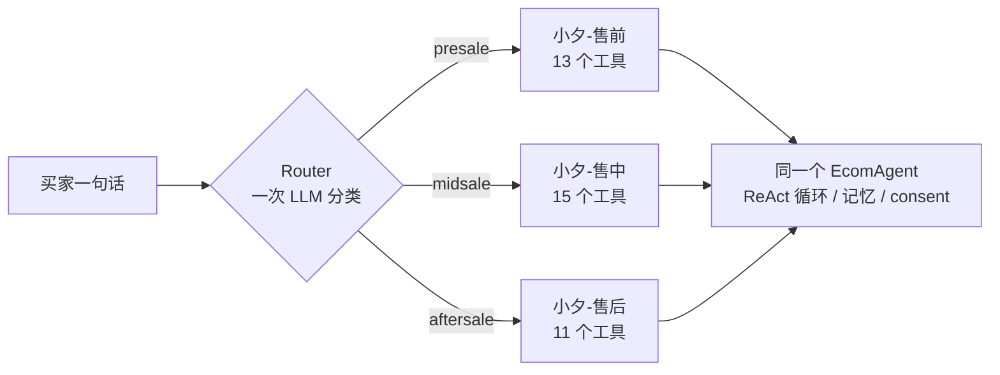
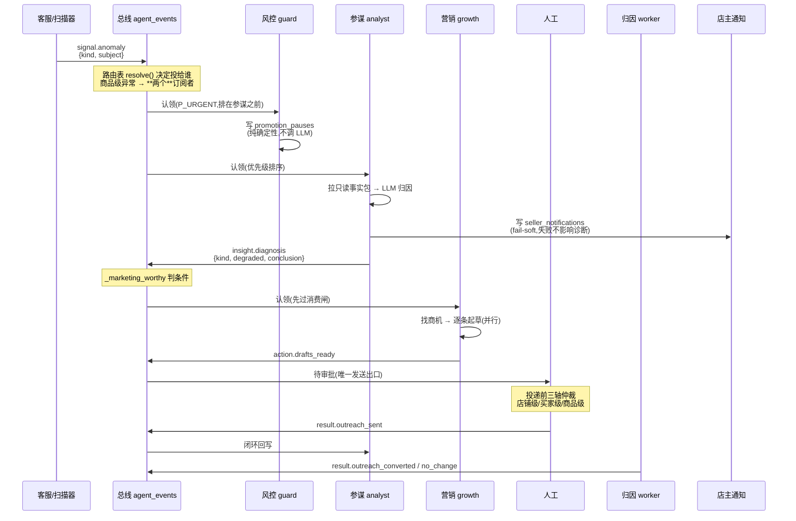
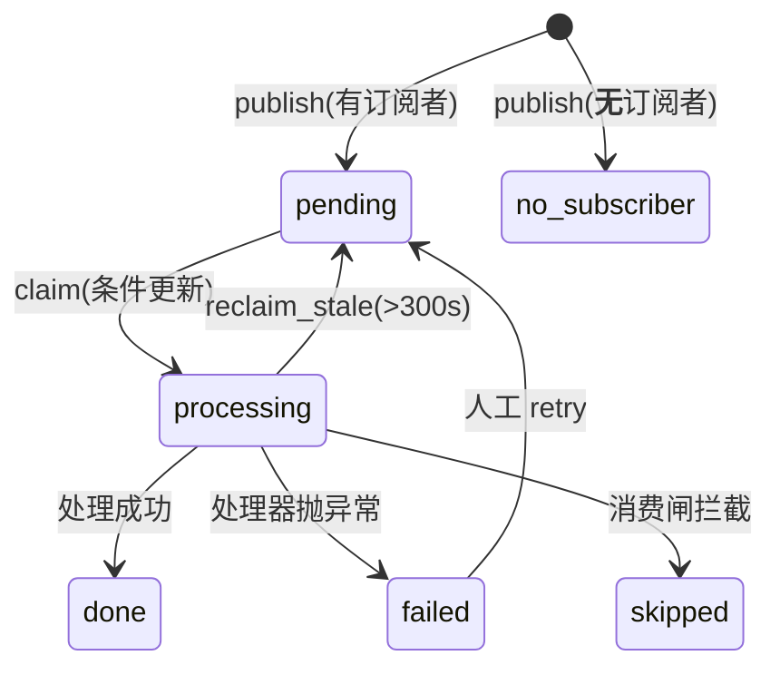

# 多智能体协作:技术文档

> 本文对应代码目录 `app/multi_agent/`(15 个模块,约 3450 行),外加
> `app/scripts/agent_collab.py`(worker)与 `app/agent/tools/{anomaly,growth}.py`
> (信号源与商机源)。所有结论都标了文件与行号,可以直接跳过去核对。
>
> **最近一次对齐代码:2026-08-16。** 本轮补的是文档写成之后落地的四块:
> 共享上下文的 Redis 后端、店主通知、跟进序列表、卖家侧对话入口(含独立的
> ReAct 预算)。另外修正了两处已经漂移的行号。

---

## 0. 先破一个误解:这里有**两套**完全不同的"多智能体"

看不懂这一块,最常见的原因是把两件事当成了一件。它们的运行时机、通信方式、
失败后果都不一样:

| | **会话内薄编排** | **后台事件驱动协作** |
|---|---|---|
| 什么时候跑 | 买家/店主每说一句话,同步 | 独立 worker 进程,异步轮询 |
| 参与者 | 5 个"画像"共享 **1 个**引擎 | 3 个 Expert(参谋/营销/人工闸) |
| 怎么通信 | 不通信——一轮只有一个画像在跑 | 持久化事件总线 |
| 谁决定下一步 | Router(一次 LLM 分类) | 路由表(纯函数,零 LLM) |
| 挂了会怎样 | 买家这一轮答不出来 | 买家无感,后台链停住 |
| 代码 | `orchestrator.py` / `router.py` / `agents.py` | `bus.py` / `routing.py` / `collab.py` |

**"多智能体协作"这个词在本项目里通常特指后面那套**(第 2 节起)。前面那套
严格说是"一个 Agent 换装",本文先用一节讲清,免得混淆。

---

## 1. 会话内薄编排:5 个画像,1 个引擎

### 1.1 形态

不是 N 个各自带一套 ReAct 循环的子 Agent,而是**同一个经过硬化的 `EcomAgent`**,
按路由结果切换**画像**(专属 system prompt + 工具子集)。

`app/multi_agent/orchestrator.py:1-7` 把理由写得很直白:复用全部硬化(空回复降级、
落盘指针、consent 门、事件流、记忆/持久化),延迟与成本低,**加一个新领域只是加一份画像**。



买家侧三个画像(`MultiAgentOrchestrator`),卖家侧两个(`SellerOrchestrator`,
`orchestrator.py:413`):

| 画像 | 标识 | 工具数 | 归属 |
|---|---|---|---|
| 小夕-售前 | `presale` | 13 | 买家侧 |
| 小夕-售中 | `midsale` | 15 | 买家侧 |
| 小夕-售后 | `aftersale` | 11 | 买家侧 |
| 参谋-小策 | `analyst` | 9(全只读) | 卖家侧 |
| 增长-小拓 | `growth` | 9(草稿型) | 卖家侧 |

### 1.2 工具子集就是能力边界

每个画像有**独立的 `ToolManager`**,只暴露该领域允许的工具
(`orchestrator.py:58-70`)。这不是为了整洁——它是硬边界:售前画像的工具表里
根本没有 `apply_refund`,所以无论提示词被怎么绕,它都调不出退款。

### 1.3 买卖隔离靠端点,不靠模型猜

`actor` 由**端点**决定(买家 `/api/chat`、店主 `/api/seller/chat`),
不让 LLM 判(`orchestrator.py:465-468`)。卖家侧 skill 只在 `ACTOR_SELLER` 下可见。

### 1.4 两个 Router 的差别

- 买家侧 `Router.route()` 可能判不出 domain → 有**粘性路由**(沿用上一轮,
  `orchestrator.py:56`);
- 卖家侧 `SellerRouter.route()` 返回值域恒为真值 → **刻意没有**回退链
  (`orchestrator.py:470-473` 明确写了为什么不该有)。

### 1.5 卖家侧的 ReAct 预算是单独一档

`settings.max_react_steps` 买家侧 **3**,`settings.seller_max_react_steps` 卖家侧
**8**,由 `SellerOrchestrator.__init__` 装到引擎上(`orchestrator.py:438-443`)。

差别不是随手调的:买家客服一轮通常 1–2 次工具(查单 → 答),而参谋的 skill 声明的是
**多步分析链** —— `daily-business-report` 要 `shop_overview → product_diagnostics →
anomaly_scan → review_insights` 四次,`refund-attribution` 是五步归因。

实测(预算还是 3 的时候):问"最近退款率是不是有问题",参谋在第三步「差评佐证」处
截断,店主得再追一句「继续」才补完报告。对店主来说那就是"它没答完",而 skill 正文
明明写着五步——**声明的流程比预算长,流程就永远走不完**,而这不是模型的问题。

### 1.6 卖家侧的对话入口

后端两条:`POST /api/seller/chat`(同步)与 `POST /api/seller/stream`(SSE,与买家侧
同一套事件协议 progress/stage/route/tool_call/reply/metadata/done,前端复用同一个
解析器)。会话落进独立的 `seller_sessions`(独立 `SessionManager` + 独立目录
`app/sessions/seller/` + 独立锁),与买家会话**完全隔离** —— 否则店主与某个买家撞同
一个 session_id 时,店主的话会落进买家会话里。

前端是「参谋对话」页(`webui/src/components/AnalystChatView.tsx`):左侧四个快捷提问
+ 当前异常 + 通知,右侧流式对话。挂载时拉一次 `GET /api/seller/{sid}/history` 回显
历史 —— 会话内容一直落在磁盘上,补这个端点之前**没有任何地方能读回来**,店主看到的
是"记录丢了",实际是"存了但取不到"。

---

## 2. 后台协作:三个 Expert,一条总线

### 2.1 参与者与事件

**Agent 标识**(`bus.py:27-30`):

| 常量 | 值 | 角色 |
|---|---|---|
| `AGENT_SERVICE` | `service` | 客服(C 端,信号生产者) |
| `AGENT_ANALYST` | `analyst` | 店铺参谋(B 端,**只读**) |
| `AGENT_GROWTH` | `growth` | 营销增长(B 端,**只出草稿**) |
| `AGENT_GUARD` | `guard` | 风控/静默(B 端,**只做负向动作**) |
| `AGENT_HUMAN` | `human` | 人工闸——需要人看的事件投给它 |

- **值**才是真正落进 `agent_events.source_agent` / `target_agent` 的字符串,路由表按它匹配。
  所以别处不许写字面量:哪里手写成 `"analysts"`,事件会安安静静躺在队列里**没有任何人
  认领**——不报错,只是那条链再也不往下走。
- **B 端 / C 端**:C 端 = 消费者(买家),`service` 跟他说话;B 端 = 商家(店主),
  `analyst` / `growth` 跟他说话。这就是 §1.3 的 actor 二分在总线上的投影。
- **`guard` 谁也不跟谁说话**——它不产出文字,只写一条会让别人少做一件事的记录。
  这是唯一一个纯负向的节点,也是 `signal.anomaly` 扇出的第二个分支(见 §3.3)。
- `AGENT_HUMAN` **不是一个 Agent,是一个收件箱**:投给它的事件没有程序消费者,
  链就停在那儿等人。

#### 「只读」和「只出草稿」不是形容词,是工具层的硬边界

这两个标签的意思很具体——**参谋读什么、营销能写什么,都是可以点出来的**:

| | 读 | 写 |
|---|---|---|
| **参谋 `analyst`** | `orders` / `order_items` / `products`(经营面与商品面)、`reviews`(评价)、`skill_traces` + `turn_signals`(服务质量与情绪)、`conversations`(咨询量)、知识库 | **无。9 个工具里写工具 0 个。** |
| **营销 `growth`** | 上面的经营面与商品面(判断值不值得推)+ 商机源(`orders`/`carts`/`bargain_sessions`/`reviews`) | **只有 `outreach_drafts` 一张表,且 `status` 恒为 `draft`** |

**参谋这一侧是"没有手段"而不是"有手段但不用"。** 它的 9 个工具
(`shop_overview` / `product_diagnostics` / `service_quality` / `anomaly_scan` /
`review_insights` + 4 个通用只读)在 registry 里**没有一个被标为 mutating**。
它接的是可被提示注入的文本(买家咨询原文会进诊断摘要),但**最坏情况只是说错一句话,
改不了任何数据**。

**营销这一侧是"写得出来,但写出来的东西没有杀伤力"。** 唯一的写工具是
`draft_outreach`,它落一行 `outreach_drafts`。**这就是它写的全部东西**——
下面是库里一条真实的草稿(`id=51`):

| 字段 | 真实值 | 是什么 |
|---|---|---|
| `content` | 「您好呀～您下单的 Nike Air Max 270 运动鞋(订单 ORD-20260811-E16C)目前还在待发货状态,已停留约 120 小时啦。咱们正抓紧处理,稍后有进展会第一时间同步您～」 | **要发给买家的那句话**。这是这行数据里唯一会被买家看到的内容 |
| `opportunity_type` | `stale_pending_order` | 属于七类商机的哪一类(`OPPORTUNITY_KINDS`) |
| `user_id` / `order_id` | `walkthrough_buyer` / `ORD-20260811-E16C` | 发给谁、关于哪一单 |
| `reason` | 「最可能的原因是该款运动鞋实际尺码偏大…建议在详情页增加提示"本款偏大,建议选小一码"」 | **给店主看的依据**,不发给买家。来自参谋的诊断 |
| `offer` | `{}` | 附带的优惠(`{"note": ..., "coupon_code": ...}`),这条没带 |
| `status` | `draft` | **恒为 draft** |
| `needs_review_reason` | 空 | 命中承诺类敏感词时写在这里,逼人工重点看 |
| `created_by` | `growth` | 谁起草的 |
| `correlation_id` | `SCAN-8032fcef94a7` | 挂回哪条协作链 |

所以"营销能写什么"的精确答案是:**它能往待审队列里放一句话,外加这句话的出处与依据**。
它不能发这句话、不能发券、不能改订单、不能碰买家的任何数据。

三个容易忽略的约束:

- `offer.coupon_code` 只是**建议**——起草这一步**不校验这张券存不存在**,也不发券;
  真正发放在审批端点里(`coupons.grants.issue_for_draft`)。
- 工具返回值里明确带 `status='draft'` 与 `needs_review_reason`,
  **让模型没法对店主谎称"已发出"**。
- 同一买家同一 kind 已有待审草稿时,数据层唯一约束直接拒,错误文案还特意写明
  "换个措辞重试也会被同样拒绝"——否则模型看到 `success=False` 的第一反应是改写重试。

> **兜底不是"检出注入",是产物形态本身就没有杀伤力。**
> 参谋最坏 = 说错一句话;营销最坏 = 多一条要人看的草稿。
> 而发送只发生在管理端审批端点里——全仓库 `mark_outreach_sent` **只有一个调用点**。

**事件类型**(`bus.py:33-38`)。

先看命名:值都是 `阶段.名词` 的形式,**前缀就是这条事件处在链的哪一段**——
`signal.` 有人发现了点什么 → `insight.` 有人想明白了 → `action.` 有人做出了东西 →
`result.` 事情有了结果。看到一个陌生事件名,光看前缀就知道它在链上的位置。

下面每一行都配了**库里真实的 payload**(不是示意):

---

**① `signal.anomaly`** —— 客服埋点 / 定时扫描 → 参谋

```
service → analyst      corr=C-c256b6061388
  kind        service_escalation      ← 异常类型
  intent      complaint
  subject     ""                      ← 涉及哪个商品/skill,这条是服务类所以为空
  session_id / user_id / reasons
```

**"我发现了一个不对劲的地方",不带任何结论。** 整条链的起点,详见 §2.3。

---

**② `insight.diagnosis`** —— 参谋 → 营销

```
analyst → growth       corr=SCAN-899066d0f813
  kind          refund_rate_high
  subject       HMDP-1
  subject_name  Nike Air Max 270 运动鞋
  conclusion    「最可能的原因是该款运动鞋尺码标注与实际穿着体验存在偏差,
                 导致买家因"偏大一码"集中退货。建议在详情页增加提示…」
  facts         {orders: 5, refunds: 1, top_reason: "尺码不准,偏大一码", ...}
  degraded      False
```

**"我想明白了,而且这是我依据的事实"。** `conclusion` 是 LLM 写的,
`facts` 是**只读工具捞回来的原始数字**——两者分开放,读的一方可以自己核对结论。
`degraded=True` 表示这条诊断是在降级状态下产出的(如 LLM 超时走了兜底),
**下游据此决定要不要用它**(见 §3.4 的 `_marketing_worthy`)。

---

**③ `action.drafts_ready`** —— 营销 → **人工**

```
growth → human         corr=SCAN-8032fcef94a7
  drafted     3                     ← 起草了几条
  diagnosis   「最可能的原因是…」    ← 依据的那条诊断,给审批的人看
```

**注意它的 `target` 是 `human`,不是某个 Agent。** payload 里**不含草稿正文**——
正文在 `outreach_drafts` 表里,事件只说"有 3 条待审"。这是刻意的:事件是**通知**,
不是数据搬运;审批界面自己去查表,拿到的永远是当前状态,而不是发事件那一刻的快照。

---

**④ `result.outreach_sent`** —— 人工审批端点 → 参谋

```
human → analyst        corr=SCAN-cb11b2915aa4
  draft_id    37
  user_id     default
```

**"人批了,而且真的发出去了"。** 由审批端点在投递成功之后才发——
**不是点击时发**。这一条把链闭回参谋,让它知道自己那条诊断最终产生了行动。

---

**⑤ `result.outreach_converted` / `result.outreach_no_change`** —— 归因 worker

```
analyst → human        corr=C-1
  draft_id        1
  user_id         u1
  order_id        OK-1
  outcome         converted
  status_at_send  pending          ← 发送那一刻的订单状态,判定基线
```

**"这条触达到底有没有用"。** 判定是**确定性的、不经模型**:目标订单状态相对
`status_at_send` 向前推进(`unpaid → pending → shipped → delivered` 的序)才算
`converted`;状态倒退(如退款)或原地不动都是 `no_change`。

`status_at_send` 必须在**发送那一刻**记下来——事后再查就分不清"这单本来就已经付了"
和"因为我们催了才付"。

---

> **五个事件连起来就是一句话**:发现异常 → 想明白原因 → 起草动作 → 人批准并发出 →
> 回头看有没有用。**每一步都换了一个参与者,而没有任何一步是某个 Agent 直接调另一个。**

### 2.2 完整链路



**风控那一跳画在参谋之前不是排版**:`run_once` 里 `consume(AGENT_GUARD)` 确实排第一。
归因实测几十秒,那几十秒里正好可能有人点批准把这个出问题的商品推广发出去——负向动作要
抢在正向动作之前落地。两个分支之间**没有数据依赖**,风控不看归因结论。

**关键**:一次 `run_once()` 就能跑完 signal → diagnosis → drafts 整条链
(`collab.py:688-707`)——参谋段消费完会当场 publish,紧接着营销段消费就能看到。
再调一次只会看到队列已空,那是幂等,不是"还有下一段"。

**通知那一支是旁路,不是链上的一环**(`collab.py:440-459`)。参谋产出诊断时顺手写一条
`seller_notifications`,让参谋对话界面能主动提醒店主(前端轮询)。它 **fail-soft**:
写失败只记 warning,不影响诊断主流程,更不影响后面营销那一段。

放在这里而不是做成一个事件,是因为它没有下游消费者——它的终点就是人眼。
做成事件反而要为它配订阅、配消费闸、配失败重试,而这些对"给店主弹个提示"毫无意义。

### 2.3 `signal.anomaly` 是怎么产生的:两个来源,一条纪律

整条链的起点。它有**两个完全不同的生产者**——一个在买家会话的热路径上实时埋点,
一个在 worker 里定时体检——但它们**发出来的东西形状完全一致**,而且都不带结论。

```
① 实时埋点                          ② 定时扫描
   streaming.py:_publish_escalation     anomaly.py:scan_and_publish
   触发点:这一轮转人工了                触发点:worker 每 20 轮跑一次
   语义:某一次会话没搞定                语义:某个指标跨线了
            │                                    │
            └──────── signal.anomaly ────────────┘
                   {kind, subject, ...}
                   source=service,不指定收件人
                            ↓
                    路由表 resolve() 决定投给谁
```

#### 来源一:转人工埋点(`streaming.py:46-79`)

买家侧每一轮结束、判定为转人工时发一条。三个设计点:

**埋在哪一层是有讲究的。** 它放在 `streaming.py` 而不是 `EcomAgent.chat()` 里,
因为"是否转人工"这件事在 `chat()` 返回**之后**才终局——HITL 规则(同一问题问 3 遍、
置信度过低、敏感意图、维权关键词)是在这一层事后追加升级的,`chat()` 自己并不知道
这些规则判过什么。

> 旧版把埋点放在 `chat()` 里、只看模型自报的 `requires_human`,**漏掉了一大类真实
> 转人工**——那些不是模型说要转,是规则强制升级的。

**`reasons` 要带上,而且要看内容不看空满。** `should_escalate` 对模型自报的
`requires_human` 也会如实回填一条"模型判定需转人工"。所以参谋看 `reasons` 的**内容**
就能分清两种情况:只有那一条 = 模型自己要转;还有低置信度/重复提问 = 规则事后强制升级。
这两者对"客服到底哪里不行"的含义完全不同。

**fail-soft 到底。** 整段包在 `try/except` 里,总线不可用**原地吞掉**——
它跑在买家会话的热路径上,绝不能让一个旁路埋点影响买家这一轮的回复。

#### 来源二:定时扫描(`anomaly.py:anomaly_scan` + `scan_and_publish`)

worker 每 `--scan-every` 轮(默认 20 轮 ≈ 100s)跑一次全店体检。**五类异常,
全部是确定性阈值判定,不调 LLM**:

| kind | 判据 | 默认阈值 | 窗口 |
|---|---|---|---|
| `refund_rate_high` | 商品退款率 | 15% | `window_days`(7 天) |
| `bad_review_rate_high` | 商品差评率(rating≤2) | 30% | `window_days` |
| **`fulfillment_delay_high`** | **商品已付款订单的待发货积压率** | **25%** | `window_days` |
| `tool_error_rate_high` | 某 skill 工具失败率 | 30% | `service_window`(1 天) |
| `human_rate_high` | 某 skill 转人工率 | 40% | `service_window` |
| `angry_rate_high` | 全店激烈情绪占比 | 20% | `service_window` |

**每一条都先过 `min_samples`(默认 5)。** 1 单退 1 单是 100% 退款率,但那不是异常,
是**没数据**。这条兜底在六处判定里全都有。

#### `fulfillment_delay_high` 补的是哪个盲区

`stale_pending_order` 是**产出草稿最多**的商机类型,但在这条规则之前,**没有任何
异常规则会为它发信号**。后果不是"少了一类告警",而是:滞留订单的草稿只能等一条
**退款率**异常恰好跑到同一个商品身上,再把那条与发货无关的诊断挂上去当依据。
实测的 draft 41 就是这么来的(见 §3.4.1)。

两个刻意的口径:

- **滞留的定义复用 `growth._STALE_PENDING_STATUS` / `_STALE_PENDING_HOURS`**(48h),
  不在扫描侧另写一个小时数。两处各定一个的后果是信号与草稿对"什么叫滞留"意见不
  一致:扫描说这个商品积压了,商机集合里却一条都找不到——而两边各自看都自洽,极难查。
- **只统计已付款(status 已推进到 `pending`)的订单。** 未支付的单子不发货是买家的
  原因,不是履约问题,混进来这个指标就失去意义了。

阈值 25% 比退款率的 15% 宽:积压 25% 已经是明确的履约问题,而退款率 15% 才算异常
——两者的正常基线本来不同。`detail` 里带 `stale_after_hours`:同样的 0.62,按 48h
和按 4h 算是两件事,而看到告警的人(和模型)没有别的途径知道是哪一个。

**两个窗口,不是一个**(`anomaly.py:94-100`):

- 经营侧(退款率/差评率)走 7 天——下单→收货→退款/评价天然滞后,**缩窗会把它们压成 0**;
- 服务健康(工具失败/转人工/情绪)走 1 天——**一个工具是不是坏的只有"现在"这一个时态**。

> 混成一个 7 天窗的后果是实测过的:**一个已经修好的工具会被连续报警 7 天。**

**扫描口径的盲区被显式报出来,而不是藏着。** 商品侧只看 `product_diagnostics` 的前
N 名,而它按**绝对退款单数**排序,不是退款率——一个退款率全店最高但销量很低的商品,
可能永远进不了阈值判断。返回值里的 `products_examined` / `products_truncated` /
`reviews_examined` / `reviews_truncated` / `service_insufficient` 就是为了让这个盲区
**在数字上可见**,不让"扫过一遍"看起来像"全店都看过了"。

#### 两个来源共守的三条

**① 只宣布事实,不指定收件人。** 两处 `publish` 都不传 `target`:

```python
bus.publish(bus.EV_SIGNAL_ANOMALY, a, bus.AGENT_SERVICE, correlation_id=corr)
#                                     ↑ source          ↑ 没有 target
```

收件人由路由表决定。想让"库存预警 Agent"也订阅异常信号,**这两处一行都不用改**——
而它们本就与那个新 Agent 毫无关系。客服那一段更是跑在买家热路径上,
它不该、也不需要知道下游有哪些 Agent。

**② 一次扫描共用一个 `correlation_id`。** 一次体检扫出的多条异常属于同一次"体检",
时间线上应该聚在一起看。而且 `corr` 在循环**之前**就生成,不依赖任何一次 publish 成功——
总线整体故障时仍会拿到一个真实可查的 id,但 `published == 0`。
**那是"链 id 生成了但一个事件都没落库"的合理状态,不是 bug**,所以判断这次扫描有没有
真发出信号要看 `published` 而不是 `correlation_id` 是否非空。

**③ payload 的 `kind` / `subject` 是硬契约。** `event_schema.REQUIRED_FIELDS` 里
`signal.anomaly` 必须带这两个字段——`kind` 同时被参谋处理器和路由谓词读,
`subject` 是共享上下文的主键。缺了任一个,事件在发布时就被拒(见 §9)。

#### 已知缺口:扫描面覆盖不到"运营卡壳"

五类异常里**没有一条是关于履约的**——比如"待发货订单积压"。所以一笔卡了 120 小时
的订单**永远不会变成 `signal.anomaly`**,不会有参谋诊断,也不会进店主通知。

它现在唯一的出口是被营销当成 `stale_pending_order` 商机、给买家发一句安抚话
(见 §10 `outreach_drafts` 那条真实草稿)。**那是安抚了症状,没上报病因**——
真正该发生的是提醒店主去发货。要补的话是在 `anomaly_scan` 里加一条规则,
其余链路一行不用改,这正是"只宣布事实、不指定收件人"换来的。

### 2.4 三层分工

```
app/multi_agent/routing.py   编排语义:订阅表、优先级、消费闸
app/multi_agent/bus.py       对外门面:publish / consume / 时间线 / 重试
app/multi_agent/event_bus.py 载体实现:当前 SQLite,可换
```

`event_bus.py:1-28` 说明了为什么要抽第三层:改造前时间线、失败列表、手动重试、
滞留回收这四条路径**绕过门面直接操作事件表**,所以"换载体只改一个文件"这句话
对三个 Agent 是真的、对观测路径是假的。

---

## 3. 路由表:这块最值得看懂

### 3.1 它解决了什么

改造前发布方直接写 `publish(..., target=AGENT_GROWTH)`,而"什么诊断该转营销"
写死在参谋的代码里。三个后果(`routing.py:5-11`):

1. 加一个订阅同一信号的新 Agent,得改客服会话**热路径**——而那与新 Agent 无关;
2. `target_agent` 是单值,同一条信号**做不到同时给两个 Agent**;
3. "营销何时被唤醒"这条规则藏在参谋模块的常量里,**运营看不到**。

改造后发布方只宣布"发生了什么",**三个 Expert 之间没有任何一方在指挥另一方**。

### 3.2 数据结构

```python
@dataclass(frozen=True)
class Subscription:
    target: str                                  # 投给谁
    when: Optional[Callable[[dict], bool]] = None   # 条件谓词,None=无条件
    priority: "int | Callable[[dict], int]" = 0     # 常量或谓词
    reason: str = ""                             # 给人看的规则说明
```

`when` **必须是纯函数**(不读库、不调模型)——路由发生在发布那一刻,而发布点
之一在买家会话热路径上,任何 IO 都会变成买家那一轮的延迟(`routing.py:44-47`)。

### 3.3 当前订阅表(`routing.py:108-136`)

| 事件 | 投给 | 条件 | 优先级 |
|---|---|---|---|
| `signal.anomaly` | 参谋 | 无 | **动态**:转人工=紧急,其余=普通 |
| `signal.anomaly` | **风控** | `_pause_worthy` | 紧急 |
| `insight.diagnosis` | 营销 | `_marketing_worthy` | 普通 |
| `action.drafts_ready` | 人工 | 无 | 普通 |
| `result.outreach_sent` | 参谋 | 无 | 普通 |
| `result.outreach_converted` | 人工 | 无 | 低 |
| `result.outreach_no_change` | 人工 | 无 | 低 |

**优先级只设三档**(`P_URGENT=10 / P_NORMAL=0 / P_LOW=-10`),不搞 0–100 连续值:
连续值会让每次新增订阅都要纠结"填 37 还是 42",而实际决策只有"更急/一般/可以等"。

**为什么优先级要支持谓词**:本项目所有异常都走同一个 `signal.anomaly` 事件类型,
"买家刚被转人工"与"例行退款率扫描"的区别在 payload 的 `kind` 里,**不在事件类型上**
——只支持常量就表达不了这个差异(`routing.py:49-52`)。

**`signal.anomaly` 是表里唯一一处真正的扇出**——一条信号落两行投递记录。在它之前
6 个事件 6 条订阅全是 1:1,扇出/谓词/优先级三套机制里只有优先级有真实用户。

两个分支的取向**相反**,这是它们必须分成两个节点的理由:

| | 参谋(analyst) | 风控(guard) |
|---|---|---|
| 做什么 | 想明白"为什么" | 立刻"少做一件事" |
| 手段 | 调 LLM,可能降级 | 纯确定性写库 |
| 耗时 | 实测几十秒 | 毫秒级 |
| 取向 | **正向**(产出结论,可能进一步产出草稿) | **负向**(暂停出问题商品的推广) |

**为什么风控拿 `P_URGENT`,以及 `run_once` 里为什么它排第一**:不是它更重要,是它必须
更**早**。归因跑几十秒,那几十秒里正好可能有人点批准把这个出问题的商品推广发出去——
负向动作要抢在正向动作之前落地。

**为什么不把它塞进营销那个消费者**(`bus.py` 的 `AGENT_GUARD` 注释):`status` 是行级
单值,"起草失败"与"静默失败"共用同一条记录时,一个失败会连带另一个被重投,而两者的重试
语义完全不同——起草可以重来,静默重复写是幂等的。

### 3.4 条件订阅有两个:`_marketing_worthy` 与 `_pause_worthy`

两个条件(`routing.py:62-86`):

1. `kind` ∈ `{"refund_rate_high", "fulfillment_delay_high"}`。它们的下游动作有明确
   因果;工具失败率、转人工率是**服务质量**问题,推销不解决它们。
   `fulfillment_delay_high` 是后加的,加它的理由很具体:**它是唯一能解释滞留订单商机
   的诊断**(见 §3.4.1)。
2. `degraded` 的诊断**不转**。归因不可用时 `conclusion` 只剩"仅列事实、归因暂不可用",
   而 `_llm_draft` 会把它原文嵌进买家话术——半成品文案写给买家没有意义。
   人工审批挡得住"内容有没有问题",挡不住"这条消息压根不该被生成"。

`_pause_worthy` 只看一件事:**这条异常的 `subject` 是不是商品 SKU**。

```
refund_rate_high / bad_review_rate_high  → subject 是 sku       ✅ 投风控
fulfillment_delay_high                   → subject 是 sku       ✅ 投风控
tool_error_rate_high / human_rate_high   → subject 是 skill 名   ❌
service_escalation                       → subject 是会话 id     ❌
angry_rate_high                          → subject 是 "shop"     ❌
```

判据按 subject 的**语义**写死在白名单里,不用"kind 里带 rate 就算"这种推断。放错一个,
静默记录的 subject 就会是个技能名或会话号,而它要跟 `order_items.sku` 比较——比较永远
不成立,这条闸变成永远不触发的死代码,**不报错、不留日志**。这个仓库在 `buyer_hints`
上已经栽过一次同样形态的跤(见 §8.1)。

**谓词里不读 `collab_promotion_pause_hours` 这个开关。** 路由发生在发布那一刻、写进
事件表就固定了,读配置意味着路由结果随配置漂移。开关放在处理器里:关掉时事件照投、照
消费、照留痕,只是不写那条会拦人的记录。**"扇出跑通了"这件事的可观测性不该依赖某个部署
方是否采纳了这条策略。**

(履约延迟也进风控,而且它是三条里最直接的一条:**发不出去的货就别再推广**——
积压时继续催付款/催下单只会把积压做得更大。)

### 3.4.1 相关性是**两问**,不是一问

一条诊断能不能用在一条商机上,要分开问两次——判据不同,合成一个布尔就必然在其中一侧出错。

| | 问什么 | 判据 | 用在哪 |
|---|---|---|---|
| `_diagnosis_applies_to` | 诊断讲的是不是**这件商品** | SKU 归一后相符 | 决定要不要把诊断喂给 `_llm_draft` 当**内容指导** |
| `_diagnosis_explains_opportunity` | 诊断能不能解释**这条商机为什么存在** | 上一条 **且** kind 在 `_DIAGNOSIS_EXPLAINS[商机类型]` 里 | 决定要不要把诊断结论写成 `reason`(**审批依据**) |

**实测缺陷 draft 41**:`opportunity_type = stale_pending_order`(订单 DEMO-010 待发货
滞留),正文写的是催发货,而「依据」栏是——

> 最可能的原因是该款跑鞋存在普遍性的**尺码偏大**问题,导致 6 笔退款全部集中于
> "尺码不准,偏大一码"…建议立即在商品详情页添加尺码提醒

商品对得上(都是 HMDP-1),所以旧的单一布尔判了适用。但**问题类型对不上**:这条依据
讲的是退款,草稿讲的是发货,**而店主正是靠这一栏决定批不批**。SKU 相符是必要条件,
不是充分条件。

修完之后同一条草稿的依据回落成 `_opportunity_reason` 给的
「`stale_pending_order · 滞留 120h · ¥899`」——后者才是这条草稿存在的原因。
而退款率诊断**仍然可以做内容指导**(商品确实对得上,"这款尺码偏大"对文案有用),
只是不再充当依据。

`_DIAGNOSIS_EXPLAINS` 现在只有一条:

```python
{"stale_pending_order": {"fulfillment_delay_high"}}
```

**未登记的商机类型判不适用,不是判适用。** 白名单缺一条的后果是"少引用一条诊断,
依据退化成商机自身的可读理由"——仍然正确;反过来默认适用的后果是"给审批人一条误导性
依据",而那是不可逆动作的唯一人工关口。这与 §4 里 fail-closed 的分配是同一条纪律。

### 3.5 扇出发生在**写入时**

路由表算出 N 个订阅者就插 N 行投递记录(同 `correlation_id`、同 payload、不同
`target_agent`),`bus.py:56-61` 解释了为什么不能"只存一行、消费时反查订阅":

> `status` 是行级单值,参谋处理完置 done,营销就再也捞不到了。

### 3.6 为什么是代码常量而不是配置表

`routing.py:20-23`:订阅条件是带业务语义的谓词(如"归因降级的诊断不转营销"),
不是能塞进 SQL 的标量比较;硬做成表就要发明一套条件 DSL。而这份表改动频率极低
(加 Agent 才动)。

> **"可配置"的价值在于集中且可见,不在于能热改。**

---

## 4. 两种拦截,方向相反——这是最容易看岔的地方

|  | **订阅条件 `when`** | **消费闸 `GATES`** |
|---|---|---|
| 何时判 | **发布**那一刻 | **消费**那一刻 |
| 能不能读库 | **不能**(热路径) | 能(worker 里) |
| 回答什么问题 | 这类事件该不该给这个 Agent | **此刻**这个 Agent 该不该动手 |
| 出错时 | **fail-closed**(不投递) | **fail-open**(放行) |

**失败方向相反不是自相矛盾**(`routing.py:163-166`):

- 订阅决定的是"要不要**凭空造出**一次 Agent 唤醒"——那是增量动作,判不清就不做;
- 闸决定的是"要不要**拦下**一件已经该做的事"——拦截是减量动作,判不清就别拦。

**为什么状态判断必须在消费侧**(`routing.py:190-193`):①发布点在热路径上,读库
会变成买家的延迟;②更要紧的是**状态在发布与消费之间会变**——事件可能在队列里躺了
整整一个 worker 间隔,发布时判等于拿过期状态做决定。

当前唯一的消费闸是 `_marketing_paused`:未结人工工单数超阈值时营销静默——
"一堆买家正等着人工处理"说明店铺当下的处境是先灭火,此时起草营销是明显的时机错误。
默认 `collab_marketing_pause_open_handoffs = 0` 即关闭。

### 4.1 冲突仲裁的三条轴

消费闸只是拦截体系的**一层**。完整的"别在错的时候打扰错的人"是三条轴,粒度依次收窄:

| 轴 | 判什么 | 在哪 | 何时 | 失效姿态 |
|---|---|---|---|---|
| **店铺级** | 未结工单数超阈值 → 全店营销静默 | `routing._marketing_paused` | 消费时 | fail-**open** |
| **买家级** | 接管中 / 有未结工单 / **距上次投递太近** | `arbitration.check_outreach_allowed` | 投递前 | fail-**closed** |
| **商品级** | **该商品正在出问题 → 不推广它** | 同上(读 `promotion_pauses`) | 投递前 | fail-**closed** |

**为什么店铺级可以 fail-open 而另两条不行**:店铺级是"时机优化",拦错了只是白少做一件
事;买家级与商品级守的是**不可逆的对外动作**——消息发出去收不回来,而少发一条下一轮
还能发。**默认值要放在漏判代价最小的那一侧,这两类落在相反的两侧。**

拒绝码是机器可读的,不靠中文文案做字符串匹配:

```
manual_takeover     正被人工接管
open_handoff        有未结工单
too_soon            距上次投递不足最小间隔        ← outreach_min_interval_hours
promotion_paused    草稿涉及的商品在静默期内      ← promotion_pauses
arbitration_failed  查不清状态(fail-closed 的出口)
```

### 4.2 两个默认值方向相反,理由必须写清

| 设置 | 默认 | 为什么 |
|---|---|---|
| `collab_marketing_pause_open_handoffs` | **0(关)** | 阈值因店而异——同样 5 条未结工单,大店是常态、小店是事故。替店主拍这个数=替他做经营决策 |
| `collab_promotion_pause_hours` | **0(关)** | 同上,时长是业务政策 |
| `outreach_min_interval_hours` | **1.0(开)** | "别在一小时内给同一个人连发两条推销"**没有**合理的因店而异空间,而它防的是不可逆的骚扰 |

前两条是"机制默认在、策略默认关";第三条不是,因为漏配的代价落在相反的一侧。
(第一条的默认值曾经是 5,后果是开发环境积压的 36 条工单把全部协作测试静默拦停——
一个本该"少做一点事"的优化变成了"什么都不做"。)

### 4.3 频次规则的三个坑

1. **只认 `status='sent'`。** approved 的草稿可能投递失败后被退回 draft
   (`revert_outreach_to_pending`),把它算进来会让一次**失败的**投递白白冻结这个买家
   一小时。
2. **必须判在 `hitl is None` 那条早返回之前。** 那条早返回原本是函数体第一句,把频次
   判在它后面等于"没配人工坐席的部署上这条规则静默失效"——而它防的是骚扰,跟有没有
   坐席没关系。
3. **商品比较走 `product_ref.same_item` 归一,不是裸相等。** 静默记录的 subject 来自
   `order_items.sku`(`HMDP-1`),调用方手里可能是 hmdp product.id(`1`)。
   `Database.active_promotion_pauses` 因此**只按时间过滤、不在 SQL 里按商品过滤**,把
   归一留给调用方。

### 4.4 `draft` 传不传决定商品级规则是否适用

审批端点传 `draft`(它要拿 `order_id` 反查 SKU);跟进序列不传——它手上是
`outreach_followups` 行,没有商品维度。**不传等于这条规则不适用,而不是拒绝**:判成
拒绝会让跟进序列被一条与它无关的规则全部掐死。同理,弃单/咨询未下单的商机
`order_id` 恒为空串,也跳过这一条。

---

## 5. 可靠性:幂等、恢复、失败隔离

### 5.1 幂等的根基是一条条件更新

`Database.claim_events`(`app/db/database.py:1255`):

```sql
UPDATE agent_events SET status='processing', consumed_at=?
 WHERE id = ? AND status = 'pending'
```

`rowcount == 0` 就是"已被别的 worker 认领"。docstring 写得很硬:

> 绝不能改成"先 SELECT 再 UPDATE"——那样同一条异常会产出两份洞察/两份草稿。

认领顺序:`ORDER BY priority DESC, id ASC`ーー**同优先级严格 FIFO**,乱序会让
"为什么这条比那条晚处理"变得无法解释。

### 5.2 状态机



`skipped` 是刻意的第三种终态(`bus.py`):

- 不是 `done`——它并没有被处理,记成 done 就是**账本撒谎**;
- 不是 `failed`——它没有出错,混进失败列表会**淹没真正的故障**。

`no_subscriber` 是第四种,而且它**不经过 pending**——它是一块墓碑,不是一条待办。

**为什么需要它**(这是实测出来的可见性缺口):

```
signal.anomaly 按 kind:  tool_error_rate_high 462 · service_escalation 288 · refund_rate_high 253
产出的 insight.diagnosis:  196 条 —— **全部是 refund_rate_high**
```

那 750 条并不是没被处理。共享上下文里有 `diagnosis:track-order`、
`diagnosis:process-return`——参谋**确实**都归因了。断点在 `_marketing_worthy`:
非退款类诊断没有下游订阅者,而改造前 `publish` 无订阅者时只记一句 `debug` 就返回,
**一行都不写**。于是排查时只能靠共享上下文反推参谋到底干没干活。

根本问题是状态机的表达力:它原本只能说"跑完了(done)"和"炸了(failed)",
说不了"**合法地没往下走**"。而"一条链正当地走到了尽头"与"根本没跑起来"在事件表上
长得一模一样。

**它对既有工作流零影响**,靠的是三条查询本来就按 status/target 精确作用域:

| 查询 | 条件 | 墓碑会被捞到吗 |
|---|---|---|
| `claim_events` | `target_agent = ? AND status = 'pending'` | ❌ 状态不对,且没有 Agent 叫 `''` |
| `reclaim_stale_events` | `status = 'processing'` | ❌ |
| `list/count_failed_events` | `status = 'failed'` | ❌ 不会把"没人订阅"报成故障 |
| `list_events`(时间线) | 不带 status 过滤 | ✅ **只出现在给人看的地方** |

`target_agent` 写空串:这条记录没有收件人,而那正是它要说的事。

`GET /api/admin/collab/health` 里的 `no_subscriber` 字段**按 event_type 分组**,
不只给总数——总数只说"有一堆链断了",分组才指得出断在哪一类事件上,而那正是
"该不该给它加个订阅者"这个决定需要的信息。它**不进 `healthy` 判定**:没人订阅
不是故障,一个暂时没人订阅的事件是完全合法的。

> **顺带说清一件没做的事**:「等人工」**没有**做成一个新状态。它已经可以推导——
> `target_agent='human'` 且 `status='pending'` 就是它,而 `list_pending_for_target`
> 已经把这批事件列出来了(实测积压 325 条)。再加一个状态是冗余,而冗余状态会让
> 幂等认领那条条件更新多一个要考虑的取值。

### 5.3 失败不自动重试

单条处理器抛异常只把**那一条**置 failed,不影响同批其它事件。**failed 不会被自动
重试**(避免坏事件无限循环),留在表里供人工在时间线上看到并决定
(`bus.py:158-163`)。所以 `bus.failed()` / `bus.retry()` 这两个出口是必需的——
没有它们,"留给人工决定"等于留给没人。

### 5.4 收尾本身也会失败

`_finish_and_count`(`bus.py:112-151`)按**实际落库结果**计数,而不是按"处理器跑完了":

- 抛异常(锁表/磁盘满)→ 计入 `persist_failed`;
- 返回 False(该行已不在 processing,大概率被并发的 `reclaim_stale` 抢回)→ 同样计入。

否则统计会撒谎。

### 5.5 滞留回收

worker 每轮**开头**先 `_reclaim_stale(300s)` 再消费(`collab.py:709`),顺序是刻意的:
回收在前,被放回 pending 的事件在**本轮**就能被重新认领。

300 秒的取法:比任何一次正常处理都长得多(不会抢走还在跑的),又远短于人发现
"worker 死了"的时间。

---

## 6. 降级:每一处都有明确的方向和理由

| 位置 | 失败时 | 方向 | 理由 |
|---|---|---|---|
| `publish` 总线不可用 | 吞掉记日志 | soft | 发布点在买家热路径,不能让买家那一轮失败 |
| 参谋 LLM 归因失败 | 写纯统计诊断,`degraded=True` | soft | 管道不能因一次模型抖动整条卡死 |
| LLM 预算耗尽 | 抛 `CollabBudgetExhausted` | 复用既有降级路径 | 不新增分支 = 不会有"没人测过的新分支" |
| 起草去重集合读不到 | 退化成不去重 | **open** | 宁可多排一条给人工,不能因读库抖动丢掉整批 |
| 单条起草失败 | 跳过该商机 | 局部 | 不拖垮整批 |
| 草稿挂链失败 | 记日志返回 False | soft | 草稿已落库,不能因此把整个事件判 failed 连累同批 |
| 订阅谓词异常 | 不投递 | **closed** | 判不清就不唤醒 |
| 消费闸异常 | 放行 | **open** | 闸是优化不是安全边界,真边界是人工审批 |
| 仲裁查不清 | 判不可发 | **closed** | 别给正在投诉的人推销 |

---

## 7. 两层并行

| | L1 事件间 | L2 起草间 |
|---|---|---|
| 并行什么 | 一批认领到的 N 条事件 | 一条诊断下的 N 个商机 |
| 位置 | `bus.py:209-228` | `collab.py:601-609` |
| 为什么 | 每条含一次 LLM(超时 30s),串行时 limit=20 最坏 600s | `_llm_draft` 是一次 LLM 往返 |

**两层共用同一个 `collab_max_parallel`(默认 4)而不是各设一个**:并发度会相乘,
8×8=64 个线程同时写 SQLite 只会互相等锁,比串行还慢(`bus.py:213-216`)。

L2 有一处职责切分值得看(`collab.py:536-543`):

- **主线程(串行)**:遍历商机 → 算去重键 → 命中则跳过 → 未命中则**占坑**;
- **线程池(并行)**:`_llm_draft` → `draft_outreach` → 挂链。

占坑留在主线程,`seen` 的语义与串行版**完全相同**,不需要任何同步原语。
并行的只有真正慢的那一段。

---

## 8. 安全边界:路由表**不是**授权

`routing.py:16-18` 这三行是理解整套设计的钥匙:

> **路由表是调度,不是授权。** 它决定谁被唤醒,永远不决定谁被允许做什么——
> 能力边界仍然由工具子集、consent 门、人工审批闸强制。
> **往这里加一条订阅不会让任何 Agent 多出一分权限。**

四道各自独立的边界:

1. **工具子集**:每个画像独立 `ToolManager`,营销画像里根本没有发送通道;
2. **consent 门**:退款/取消/改地址/成交需要本轮确认(跨 MCP 进程要显式透传);
3. **人工审批闸**:`action.drafts_ready` 永远投给 `AGENT_HUMAN`,**这是唯一的发送出口**;
4. **投递侧仲裁**:`arbitration.check_outreach_allowed`,fail-closed。

### 8.1 `buyer_hints`:跨 Agent 经验共享,但走确定性映射

参谋发现"这个商品退货多、差评集中在尺码",客服下次遇到该商品咨询时该更谨慎。
但**不能直接把诊断注入买家上下文**(`buyer_hints.py:11-30`):

> 诊断里的 `conclusion` 是写给**店主**的,形如「跑鞋退款率 30%,已超告警线 15%」。
> 这段话进了买家会话的 system prompt,客服就可能说出「我们这款鞋退款率确实偏高」
> ——把内部经营数据泄露给顾客,而且是以"客服亲口承认"的形式。

有人会说加一句"不要透露"就行。**本项目自己实跑验证过相反的结论**:品牌语气那次
实验里,拼接顺序**保得住动作**(`apply_refund` 确实没执行)、**保不住话术**
(Agent 照样说出了无条件退款的承诺)。

所以这里按异常 `kind` 查一张**固定文案表**,产出的提示**没有任何数字、没有任何
LLM 生成内容、不含诊断结论原文**——泄露风险从"靠模型自觉"变成"结构上不可能"。

代价是提示笼统("该商品近期退货反馈较多"而不是"退款率 30%")。这个代价划算:
客服需要的是**行为调整**,不是精确数字。

### 8.2 `outreach_context`:营销投完一条消息之后,下一轮谁接、拿什么接

同一条轨上的第二个用户。修的缺陷是**营销发完就走**:投递走
`_append_agent_reply(intent="growth_outreach")`,把消息追加进买家自己的客服会话
(信封与模型正常输出同构,界面上分不出来),然后营销退场。而那条消息常以问句结尾
——实测 draft 41:「需要帮您看看是卡在哪儿了吗?」

买家回一句"好啊",接手的画像看得到那句话,却不知道它是店铺主动发的、带了哪张券、
关联哪一单。

**刻意没有新建"营销承接画像"。** presale 手上早就有 `query_coupons` /
`query_product` / `place_order` / `add_to_cart` —— 回答营销问题、推动付款本来就是
它的活;新建一个只读画像等于做一个**功能更弱的 presale 副本**(它会砍掉
`place_order`,而那正是"推动付款"最需要的)。缺的从头到尾只是把上下文带过去。

**不加存储,应答时反查。** 买家下一轮需要的全部信息都已经在 `outreach_drafts`
那一行里,再复制一份到会话状态只会多出一个会漂移的副本。两个前提都要成立:

```
recent_sent_outreach(user_id, within=24h)   窗口内有已投递触达
awaiting_reply(raw_messages)                上一条 assistant 就是它(读信封的 intent)
```

第二条是必需的:窗口是 24 小时,买家可能在这期间已经聊了三轮别的事,那时触达偏好
不该再干扰路由。

**注入的内容仍走确定性映射**(同 §8.1 的纪律)。三样,全部固定来源:商机情境
(查 `growth.OPPORTUNITY_KINDS` 的中文标签)、订单号、券码。

两个字段**刻意不注入**:

- `reason`(审批依据)——它是给店主看的经营判断(「该款跑鞋尺码偏大,导致 6 笔退款,
  建议在详情页添加尺码提醒」)。进了买家上下文,客服就可能说出"我们这款鞋退款率
  确实偏高";
- `content`(触达正文)——它**已经在会话历史里**,画像本来就看得见,重复注入只会让
  同一句话出现两次。

券码是可以给的(投递前 `issue_for_draft` 已经把券发给买家了),但**规则不能凭印象说**
——编一个门槛出来的后果是顾客照着它下单。

**这一行的措辞按当轮画像的工具集分岔**,因为注入是追加在**被路由到的那一个**画像的
system prompt 上,而三个画像的工具集不同:

| | `query_coupons` | 注入的措辞 |
|---|---|---|
| presale | ✅ | 「**必须用 `query_coupons` 查实际规则再回答**」 |
| midsale / aftersale | ❌ | 「**本轮没有查券规则的工具**,所以**不要说明面额、门槛或有效期**…可在卡包查看,或提出转由售前同事协助」 |

实测可达的路径:买家对一条带券的催付款触达回**「我要退款」**→ 路由(正确地)去
aftersale → 若不分岔,它会拿到一句"必须用 `query_coupons` 查",而它没有这个工具。
后果两种都不好:模型忽略它(这句成了噪声),或者真去调它(工具不在 tool list 里,
白耗一步 ReAct 预算——买家侧只有 3 步)。

**这与本项目自己的纪律是同一条**:prompt 里的**要求**不能指向一个当轮不存在的工具,
和 §8.1 那条"prompt 里的禁令不能用来守硬边界"同源。

**拿不到工具时不是删掉这一行,而是换措辞。** 反编造保护在**没有**查券工具时更需要
——连查都查不了,凭印象说门槛的风险反而更高。两支都有护栏,只是行动指引不同:
能查的让它查,不能查的让它别说、并指出正确的下一步。

`available_tools=None`(调用方漏传)走**保守那一支**:漏传的代价是少一次主动查券,
而默认宣称一个可能不存在的工具的代价是一条无法执行的指令。工具名取
`tool_manager.tool_names()` 而不是 `AGENT_CONFIGS` 的声明——MCP 开启时真正可用的
那一套来自远端,与本地声明不是同一份。

> **顺带回答一个容易误解的问题:三个画像现在"都带营销属性"了吗?** 没有。工具集
> **一行都没改**(13/15/11 个,`git diff` 对 `agents.py` 与 `registry.py` 是空的),
> 每轮也只有**被路由到的那一个**画像会拿到这段前情,而且只在"窗口内有触达 + 上一条
> 就是它"时才有。**营销属性长在会话状态上,不在画像上**——画像是长期的能力边界,
> "刚收到过一条催付款消息"是一次性的会话事实,把后者做成前者就是新建第四个画像
> 那条错路。

### 8.3 一个实测的教训:前情必须喂给**主路径**

第一版把前情接到了 `Router.route` 上,而生产主路径是
`understanding.understand()`(`query_understanding_enabled` 默认开)。它只取最近
5 条 **user** 消息 —— 营销触达是 assistant 消息,**对它完全不可见**。

线上实测同一句话的两次对照:

| | 路由结果 | 后果 |
|---|---|---|
| 接前情之前 | `intent=订单事务` → **aftersale** | aftersale 没有 `query_coupons`、没有 `place_order`:券讲不清、款也付不了 |
| 接前情之后 | `intent=商品咨询` → **presale** | 「已为您查到,当前有一笔待支付订单 ORD-… 您可直接点击『立即购买』完成支付;如需我帮您确认优惠券是否可用…」 |

买家两次都只说了「好啊,帮我看看」这七个字。

而"在编排层做回落偏好"这个方案**修不了它**:回落只在这一步判不出域时生效,而它
几乎总能判出一个域——只是判错了。**给它那个缺失的事实,判定权仍然留在原处。**
(编排层的回落偏好仍然保留,它管的是另一种情形:判不出域时,拿商机类型猜比拿粘性
上一轮猜准。)

已知边界:短句先走 `understanding._match_rules`(确定性规则,`source=rule`),那条
路不看前情。可接受——规则是逐字匹配的固定表,不是猜。

---

## 9. 事件标准:防的是"什么都没发生"

`event_schema.py:1-16` 记录了一个因路由表引入而**变严重**的风险:

```
生产方漏发 kind → 谓词判否 → resolve() 返回 [] → publish 返回 None
                → 整条营销链静默消失
```

没有异常、没有 failed 事件、时间线上什么都没有。

> **失败形态是"什么都没发生",这是所有失败形态里最难查的一种——你不会去查
> 一件你不知道没发生的事。**

三条取舍:

- 只声明必需字段,**不引入校验框架**(要防的是"字段没了",不是"类型错了");
- 校验不通过**照常发布**(热路径上一条埋点的 schema 问题不该让买家那一轮失败);
- **最重要的保障是测试**:`test_collab_event_schema.py::test_routing_predicates_only_read_declared_fields`
  钉住"路由谓词读到的每个字段都必须已声明"。运行时校验只能告诉你"刚才漏了",
  测试能在合进主干**之前**就拦住。

必需字段表(`event_schema.py:38-47`):

| 事件 | 必需字段 | 为什么是这几个 |
|---|---|---|
| `signal.anomaly` | `kind`, `subject` | kind 被参谋与路由谓词读;subject 是共享上下文主键 |
| `insight.diagnosis` | `kind`, `degraded`, `conclusion` | 前两个决定要不要唤醒营销;conclusion 会被原文嵌进买家话术 |
| `action.drafts_ready` | `drafted` | |
| `result.outreach_sent` | `draft_id`, `user_id` | |
| `result.outreach_*` | `draft_id`, `outcome` | |

---

## 10. 数据表

### `agent_events`(`database.py:263`)

```sql
id, event_type, payload, source_agent, target_agent,
correlation_id, status, priority, created_at, consumed_at
```

两个索引:`(target_agent, status, priority, id)` 服务认领;
`(correlation_id, id)` 服务时间线。

> 顺带:这张表天然是一个 **Transactional Outbox**——将来真要上 Kafka,
> 最难的那一半已经做完(`event_bus.py:25-28`)。

### `shared_context`(店铺级,非会话级)

每条必带 `source_agent` 与 `correlation_id`——读的一方要知道**这是谁在哪条链上写的**,
不能当成客观事实(`shared_context.py:4-6`)。注入 prompt 时一律走
`render_context_block` 加数据围栏。

三种 key:`diagnosis:` / `anomaly:` / `opportunity:`,默认 TTL 86400 秒。

**后端可插拔**(`settings.shared_context_backend`,默认 `redis`):

| 后端 | 存法 |
|---|---|
| `sqlite` | 走 `Database`,与事件总线/业务数据共用同一个文件 |
| `redis` | Hash 存条目(`shared:ctx:{kind}:{subject}`)+ EXPIRE 做 TTL + Sorted Set 做时间索引(`shared:idx:{kind}`),pipeline 原子提交 |

Redis 挂了 **fail-soft 且不回退 SQLite** —— 共享上下文是**可重算**的(worker 下一轮
扫描会重新生成诊断),丢一轮只影响本次注入,不损害数据正确性。回退反而会制造
"两个后端各存了一半"的分裂状态。

> **索引 score 必须严格递增,不能直接用时间戳**(`shared_context.py:_next_score`)。
> Windows 上 `datetime.now()` 的实际精度约 10ms——实测连续 6 次调用只得到 2 个不同值。
> 同一 tick 内写入的两条拿到相同 score,而 `ZREVRANGE` 对同分成员退化成按 member
> **字典序倒序**:先写 OLD 后写 NEW,取回来第一条是 OLD。也就是说"最近写入的排在前面"
> 这个保证在同一毫秒内根本不成立,**而一条协作链上的多条诊断恰恰常常是连着写的**。
> 现在取 `max(当前时间, 上一个 score + 1μs)`;已知边界是计数器为进程内的,跨实例
> 同毫秒仍可能错序——为它加一次 Redis 发号的 RTT 不值。

### `outreach_drafts`

营销的产物。`correlation_id` 由 `_attach_correlation` 挂回协作链,带
**状态守卫** `AND status='draft'`:一旦人工已 approved/rejected,
correlation_id 只是回溯标签,不该在审批之后被悄悄改写(`collab.py:629-633`)。

### `outreach_followups`(跟进序列)

```sql
id, user_id, kind, correlation_id, step, max_steps,
next_touch_at, status, stop_reason, created_at, updated_at
```

一次触达不是"发一条就完事":买家没反应,合理的下一步是隔一段再提一次。
这里**自动化的只是调度**(判断到期、要不要继续、起草这一步的话术),
**不是发送**——发送仍然只发生在审批端点里(`followup.py:1-8`)。

终止条件**全部确定性、全部由已落库的状态判定,不问模型**:

1. 该买家该 kind 的商机已消失(已支付/已下单/购物车已转化);
2. 上一条触达已被归因 worker 判成 `converted`;
3. `check_outreach_allowed` 判不可发(接管中/有未结工单)——**复用现有仲裁,不新建判断**;
4. 达到 `max_steps`(默认 3,间隔 48h)——由数据层直接收尾,那不是"被拦下",是正常走完。

条件 3 优先级最高、无条件先判:买家正被人工处理这件事,不该因为"商机技术上还开着"
被绕过。同一买家同一 kind 只能有一条 active 链,靠**数据层唯一索引**兜底而不是
调用方自觉。

### `seller_notifications`(店主通知)

```sql
id, kind, title, summary, severity, read, suggested_question, created_at
```

参谋产出诊断时旁路写入(见 §2.2)。`suggested_question` 是给界面用的——点一下就把
"帮我分析一下 XX 的 YY 异常"填进输入框,**让通知能直接接回对话**,而不是让店主
看完提示再自己组织一遍问题。`severity` 按超线倍数判(>1.5× 为 warning)。

### `promotion_pauses`(商品级推广静默)

```sql
id, subject, kind, reason, correlation_id, created_at, until
```

风控节点(`collab.handle_guard`)收到商品级异常时写入,投递侧仲裁读取(§4.1)。

**为什么落表而不是在闸里现算"最近有没有该商品的异常"**:静默是一个**对外动作被拦掉**
的原因,它必须能被回溯——店主问"为什么这条没发出去",答案得指得出一行记录,而不是
重新跑一遍当时的判断。`correlation_id` 让这行记录挂回产生它的那条协作链。

**不做去重**:同商品重复写静默是幂等的(生效期取最晚那条),而合并写入会丢掉"这次是
哪条链要求静默的"这个线索。表本身极小(商品数 × 异常次数),不值得为省几行牺牲可追溯性。

**写失败要抛,不能吞**——与参谋侧的店主通知相反。通知写失败只是少一条提醒;静默写失败
意味着一个正在出问题的商品**仍然可以被推广**。抛出去让这条事件判 `failed`,
`retry_failed_event` 才能把它捞回来重投。

### 顺带:worker 产生的流量怎么标

`skill_traces` / `session_archive` 都有 `source` 列(`runtime_context.py` 的
`SOURCE_*`)。协作 worker 跑的是**真实店铺数据**,它触发的参谋会话按 `live` 记;
而压测、离线评测、多轮模拟各有自己的取值。看门狗的自动转正/回滚**只认 `live`** ——
细节见 `docs/自进化Skill技术文档.md`,这里只提一句:两个子系统共用同一张轨迹表,
改动那个字段时两边都要看。

---

## 11. 运维

### worker

```bash
python -m app.scripts.agent_collab --once     # 跑一轮协作
python -m app.scripts.agent_collab --scan     # 跑一轮异常扫描
python -m app.scripts.agent_collab --attribute # 跑一轮触达转化归因
python -m app.scripts.agent_collab --followup  # 跑一轮跟进序列
python -m app.scripts.agent_collab --loop      # 常驻
```

**常驻模式下两种节奏是分开的**,这是刻意的(`agent_collab.py:9-25`):

| 参数 | 默认 | 管什么 |
|---|---|---|
| `--interval` | 5s | 消费轮询。**唯一有延迟意义的一段**——`buyer_hints` 靠它 |
| `--scan-every` | 20 轮(≈100s) | 扫描/归因/跟进 |

**限频的理由是钱不是 CPU**:实测四段空转耗时 consume 8.6ms / scan 14.8ms /
attribute 2.0ms / followup 2.2ms,全跑也才 332ms/分钟。但 `scan_and_publish`
**不去重**,而退款率跨线这类异常会持续存在——扫描频率 ×12 = 异常事件 ×12 =
参谋归因的 LLM 调用 ×12,日预算(默认 200)几分钟就烧穿。

> 改造前它们绑在同一个 interval 上,于是只有两个选择:整体快(烧穿预算)或
> 整体慢(牺牲 buyer_hints 新鲜度)。**那不是参数没调好,是节奏被耦合了。**

### 配置项

| 配置 | 默认 | 说明 |
|---|---|---|
| `collab_enabled` | `True` | 总开关,关掉后所有入口静默 |
| `collab_bus_backend` | `sqlite` | 载体 |
| `collab_daily_llm_budget` | `200` | worker **进程内**当日 LLM 次数;0=不限 |
| `collab_llm_timeout_s` | `30.0` | |
| `collab_llm_max_retries` | `1` | |
| `collab_parallel_enabled` | `True` | 关掉 = 逐字节回到串行 |
| `collab_max_parallel` | `4` | L1 与 L2 **共用** |
| `collab_marketing_pause_open_handoffs` | `0` | 营销静默阈值,0=关闭 |
| `shared_context_backend` | `redis` | `redis` / `sqlite`,见 §10 |
| `followup_max_steps` | `3` | 跟进序列最多几步 |
| `followup_interval_hours` | `48` | 两步之间的间隔 |
| `outreach_attribution_window_hours` | `24` | 发送后多久判定转化 |
| `seller_max_react_steps` | `8` | 卖家侧 ReAct 预算(买家侧是 3,见 §1.5) |

> ⚠️ `shared_context_backend` 默认是 **redis**,而测试不该依赖一个真实的外部服务——
> `tests/conftest.py` 把它钉成 `sqlite`。不钉的话,没有显式指定后端的用例会去连本机
> Redis:诊断写进 Redis、时间线从 SQLite 读,一条都对不上(实测打红 4 条)。
> 要测 Redis 路径的用例自己 monkeypatch + 注入 fakeredis。

> ⚠️ `budget_status()` 读的是**本进程**计数器。API 进程查 `/api/admin/collab/health`
> 看到的是 API 进程的计数(恒为 0),不是 worker 的(`collab.py:91-94`)。

### 管理端点

| 端点 | 用途 |
|---|---|
| `GET /api/admin/collab/timeline` | 一条链的完整事件 |
| `GET /api/admin/collab/chains` | 最近的协作链 |
| `GET /api/admin/collab/routing` | **把路由表渲染出来给人看** |
| `GET /api/admin/collab/health` | 预算/失败数 |
| `GET /api/admin/collab/inbox` | 投给人工的事件 |
| `POST /api/admin/collab/failed/{id}/retry` | 手动重投 |

卖家侧(全部走 `admin_auth` + `_require_seller_console`,经营数据不能比对话本身更容易拿到):

| 端点 | 用途 |
|---|---|
| `POST /api/seller/chat` | 同步对话 |
| `POST /api/seller/stream` | SSE 流式对话(前端用这条) |
| `GET /api/seller/{sid}/history` | 历史回显(见 §1.6) |
| `GET /api/seller/notifications` | 通知列表(前端 30s 轮询) |
| `POST /api/seller/notifications/{nid}/read` | 单条已读 |
| `POST /api/seller/notifications/read-all` | 全部已读 |
| `GET /api/seller/overview` | 参谋对话页左侧的当前异常 |

`describe()`(`routing.py:253-281`)存在的理由:这份表是"多 Agent 到底怎么协作"的
权威声明,**必须能被人读到,而不是只能靠翻代码**。

它对谓词式优先级如实标 `dynamic=True` 并给中文说明,**不挑一个档位糊弄**——
管理端摆出一个"普通"会让人以为转人工也排在普通队列里,而那正好是这条谓词存在的理由。

---

## 12. 换载体:已知的四处语义鸿沟

`event_bus.py:18-28` 明确写了**当前不需要 Kafka**(单店、单实例、worker 60s 轮询、
一次几十条事件,引入它是纯运维负债)。抽这一层的价值是"改动面可指认"。

真要换那天,Kafka **一个都不提供**的四件事:

1. **优先级认领** —— 分区内严格按 offset,没有优先级队列;
2. **单条 skipped/failed 状态** —— offset 只能前进,要靠重试 topic + 死信 topic;
3. **按 correlation_id 查时间线** —— Kafka 不是数据库;
4. **按 id 精确重投** —— DLQ 里也做不到。

> 所以那天的正确形态是**叠加而非替换**:Kafka 走传输,本表继续作查询投影。

---

## 13. 容易看岔的几点

1. **`forwarded` 字段的语义变了**。从"我(参谋)决定转了"变成"路由表判定有下游"。
   字段名保留(外部有断言),但读的时候要按新语义理解(`collab.py:467-468`)。

2. **`publish` 返回 `None` 有两种含义**:发布失败,或**没有任何订阅者**。
   两者在调用方看来都是"这条链没起来",故合并;但**不要据此认为 None 一定是故障**
   ——一个暂时没人订阅的事件是完全合法的(`bus.py:66-68`)。

3. **`AUTONOMOUS_DRAFT_KINDS` 与 `_MARKETING_WORTHY_KINDS` 是两件事**:
   前者是"被唤醒之后去捞哪几类人",后者是"什么异常配得上一次营销动作"
   (`routing.py:83-85`)。

4. **并行后草稿的落库顺序不再等于商机优先级**。控制台按 `priority_score` 展示,
   审批也不依赖 id 顺序——**别以为 id 递增等于优先级递减**(`collab.py:551-553`)。

5. **未登记的 event_type 返回 `[]` 而不报错**。"没人关心"与"配置漏了"在运行时
   无法区分,报错只会让"引入一个新事件类型"变成一次线上故障——而那恰恰是这套
   架构应该让它变容易的事(`routing.py:155-158`)。

---

## 14. 想加一个新 Agent,要动哪几处

1. `bus.py` 加一个 `AGENT_XXX` 常量;
2. `routing.py` 的 `SUBSCRIPTIONS` 里**加一行**(带 `reason`);
3. 写一个 `handle_xxx(event) -> dict` 处理器;
4. `collab.run_once()` 里加一次 `bus.consume(AGENT_XXX, handle_xxx)`;
5. 如果它需要状态拦截,在 `GATES` 里加一条;
6. 如果它发新事件类型,在 `event_schema.REQUIRED_FIELDS` 里声明必需字段。

**不需要碰**:客服会话热路径、扫描器、参谋/营销任何一方的代码。
这正是把编排决策搬到路由表的全部收益。
