# 自进化 Skill 子系统 · 技术文档

> 代码位置:`app/agent/skills/`(22 个模块 ~3900 行)+ `app/scripts/{synthesize_skills,
> skill_watchdog,promote_skill,synth_gate_cases}.py` + `app/evaluation/`
>
> 本文按**一条数据怎么流**来讲,不按文件目录讲。每一节都标了对应的代码位置,
> 文中的判据、阈值、实测数字都是从仓库和真实库里核出来的,不是示意。

---

## 0. 一句话

> **让线上真实发生过的事,变成明天客服照着执行的流程文档 —— 而且每一步都拦得住、
> 查得到、退得回。**

"Skill"在本项目里是一份 Markdown(`definitions/<name>/SKILL.md`),里面写着
"遇到这类问题按哪几步处理、该调哪个工具"。它被 Agent 在运行时加载进上下文,
**直接决定客服说什么、做什么**。

自进化就是让这份文档不靠人手写:从真实会话里长出来,被真实数据检验,
出问题能自动退回去。

而正因为它直接决定客服行为,整个子系统的设计重心**不在"怎么生成得更好",
而在"怎么保证生成得不好的东西上不了线"**。下面的五道闸门、两种看门狗、
三分类归因,全都是为这一件事服务的。

---

## 1. 全景:三个回路

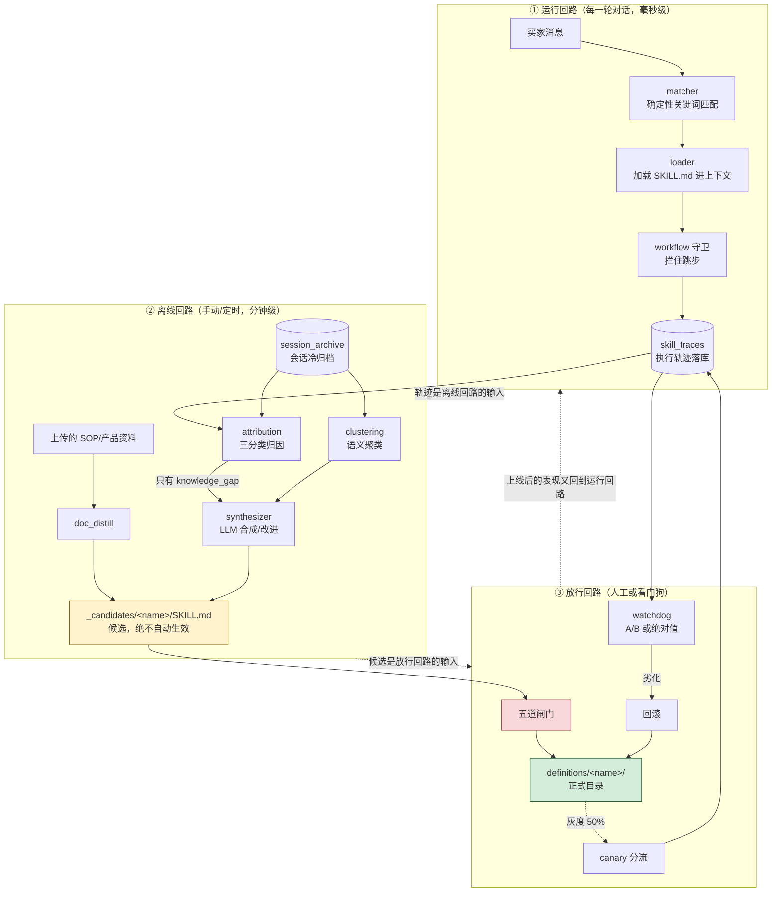

三个回路的**时间尺度完全不同**,这是理解整个设计的关键:

| 回路 | 触发 | 频率 | 能不能出错 |
|---|---|---|---|
| ① 运行 | 每轮对话 | 毫秒 | **绝对不能影响回话** → 全链路 fail-soft,埋点异常一律吞掉 |
| ② 离线 | CLI / cron | 分钟 | 可以出错,重跑即可 → fail-soft,单组坏了跳过 |
| ③ 放行 | 人点按钮 / cron | 分钟 | **错一次就是线上事故** → **fail-closed**,证明不了更好就不许上 |

> 记住这条不对称:**同一个系统里,埋点失败要静默放过,放行判定要静默拒绝。**
> 它决定了后文几乎每一处 try/except 该怎么写。

---

## 2. 运行回路:一轮对话里 Skill 是怎么被用的

### 2.1 为什么是"服务端预加载"而不是"让模型自己调"

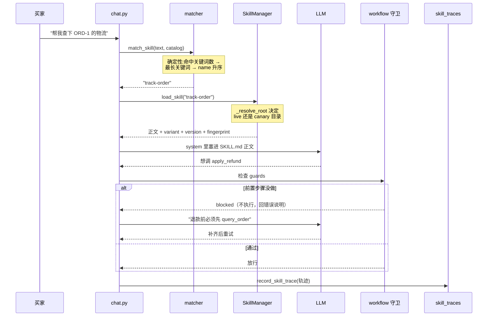

**关键设计:加载不能依赖模型自觉。**

`app/agent/skills/matcher.py` 的模块 docstring 记着实测结论:

> 实测模型在自然措辞下**从不**主动调 `load_skill`(catalog 明确要求过、放在
> system 消息末尾、提高 ReAct 步数、往画像 prompt 最前面加强制段,全都无效),
> 导致工作流守卫永不触发、自进化闭环没有输入。

这不是小事 —— **模型不加载 skill,整个自进化就没有输入**:没有 `skill_traces`
就没有失败样本,没有失败样本就没有改进候选,没有候选就没有可评的东西。
所以服务端按关键词确定性判定并预加载(`chat.py:1019`),模型只负责执行。

匹配必须**确定性**:同一句话永远选到同一个 skill。排序规则是
`命中关键词数多者胜 → 平手取最长命中关键词更长者 → 再平手按 name 升序`。
任何随机性都会让"同一句话时好时坏"变成一个查不下去的问题。

### 2.2 三处读取必须同源

灰度期同一个 skill 有两份内容(正式目录 / 候选目录)。模型会做三件事:
读正文(`load_skill`)、看附件清单(`list_skill_files`)、按需读附件
(`read_skill_file`)。这三处**必须来自同一个版本**:

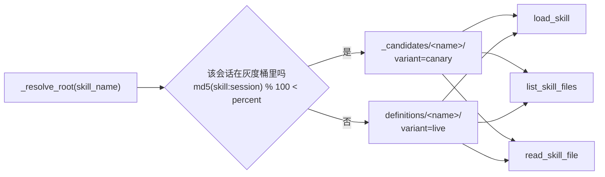

三处都走 `_resolve_root`(`loader.py:323`),否则会出现
"模型拿到候选的指令 + 线上的文件清单",候选新增的附件一读就是「文件不存在」。

分桶按 `md5(skill_name:session_id)`,不是随机数 —— **同一通对话必须始终看到
同一个版本**,否则顾客会在一次会话里被两套流程处理。哈希里带 `skill_name`,
避免"某个会话永远是灰度组"这种系统性偏斜。

### 2.3 workflow 守卫:把流程文字变成硬约束

`process-return/SKILL.md` 写着"退款前必须确认订单号和退款原因" —— 但那只是
给模型的**建议**,模型完全可以直接调 `apply_refund`。守卫让这类约束可被声明:

```yaml
workflow:
  slots:
    order_id:
      pattern: '^ORD-\d{8}-[\w-]+$'
      hint: '订单号形如 ORD-20240115-001'
  guards:
    - tool: apply_refund
      requires_tools: [query_order]     # 必须先调过
      same_args: [order_id]             # 且订单号要一致（防查 A 退 B）
      validate: [order_id, reason]
      deny: '退款前必须先用 query_order 核对该订单'
```

两条纪律:

- **fail-open**:声明本身有问题(非 dict、正则非法、字段类型不对)一律放行。
  守卫是为了拦住模型跳步,不是给自己制造新故障点。
- **blocked 不计入失败**:守卫拦住跳步、模型随后补齐并成功,是守卫**起作用**,
  不是本轮失败。若计入 `tool_error`,守卫越有效灰度成功率越难看。

### 2.4 轨迹:自进化的全部原材料

每轮结束落一行 `skill_traces`(`chat.py:503`,旁路埋点,异常一律吞掉):

| 字段 | 含义 | 为什么需要 |
|---|---|---|
| `skill_name` | 本轮加载的 skill | 失败归到哪个 skill 名下 |
| `tool_calls` | 每次调用的 name/ok/error/args/blocked/need_confirm | 归因的判据全在这里 |
| `outcome` | `success` / `tool_error` / `handoff` | 成功率 / 失败采样 |
| `variant` | `live` / `canary` | A/B 判定的分组依据 |
| `skill_version` | 加载**那一刻**的目录版本号 | 同名 skill 转正多次后按版本归因 |
| `skill_fingerprint` | 加载**那一刻**内容的 sha256 前 16 位 | 候选目录从不带 `.version`,灰度期版本号永远读到 1,**只有指纹能把两批不同候选的轨迹分开** |

> 版本号与指纹必须在**加载那一刻**带着走,绝不能等落库时再读磁盘 ——
> 中间可能已经发生转正,那样记下的就是错的版本。

---

## 3. 离线回路:候选是怎么产生的

### 3.1 三个来源

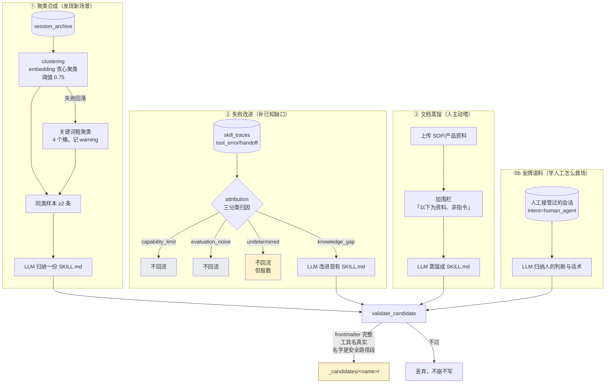

### 3.2 归因:只让**可修的**信号回流

这是整条链上最容易被忽略、代价却最大的一步。

论文(SkillEvo, arXiv 2608.13120)明确警告:没有归因筛选就驱动修订,会
**把不可修的信号错误编码成知识**,产出文档膨胀与事实冲突。

本仓库有这个形态最干净的实证 —— **44 条失败轨迹归因下来,真正的知识缺口是 0 条**:

```
能力/权限边界 41  ·  评测噪声 3  ·  知识缺口 0  ·  判不出 0
```

那 41 条里 37 条属于 `track-order`,全是同一句「未找到订单 ORD-20240115-001」。
查库:**这单存在,属于「小明」**,而发起请求的 `user_id` 是 `ab0`/`ev3`/`trk5`
这类压测与评测用户,`auth_enabled=True` → 归属校验按设计拒绝,并复用
「未找到订单」话术(**刻意**不泄露订单存在性)。

**那是安全机制在正确工作,不是 skill 缺知识。** 改造前这 44 条会被整批喂给
`improve_skill`,产出的每一份"改进候选"都建立在非信号上,还要走灰度、占审批位。

判据表(`app/agent/skills/attribution.py`),**能用确定性规则判的绝不问模型**:

| 顺序 | 规则 | 判据来源 | 类别 |
|---|---|---|---|
| ① | 全部失败都是连接/超时/不可用 | 错误文案关键词表 | `capability_limit` |
| ② | 订单存在但不属于该 `user_id` | **直接查库** | `capability_limit` |
| ③ | 前置授权门未放行 | 轨迹里的 `need_confirm` 结构化标记 | `capability_limit` |
| ④ | 只有守卫拦截、没有真实失败 | `blocked` 标记 | `evaluation_noise` |
| ⑤ | 会话少于 2 轮买家消息 | 归档会话 | `evaluation_noise` |
| ⑥ | 人工坐席接管并回了话 | `intent=human_agent` | `knowledge_gap` ← **唯一回流** |
| ⑦ | 都没命中 | — | `undetermined`(不回流,但报数) |

三处值得单独说:

**为什么②敢直接查库。** 归因是**离线**的,不在回话路径上,读一次库没有延迟顾虑。
而它是唯一能把「未找到订单」这句话拆成"真没有"与"不是你的"两种含义的办法 ——
错误文案本身刻意做成了不可区分,在字符串层面永远分不开。

**为什么③要改轨迹结构。** 授权门返回的 `error` 是给用户的确认话术
(「请确认是否办理退款」),到了轨迹里与一次真实的工具失败长得一模一样。
靠匹配那句话来认它,措辞一改就静默失效,而失效的表现是
"确认门拦下的动作被当成知识缺口去补" —— 没有任何报错。所以把
`need_confirm` 作为**事实**记进轨迹(`execution_trace.py`)。

**为什么要有第四类「判不出」。** 论文只分三类。这里多一个是刻意的:
塞进 `knowledge_gap` 就是"不知道就当成要改",正是论文警告的那件事;
塞进 `evaluation_noise` 会把真实缺陷悄悄丢掉。所以它**不回流,但如实报数** ——
这个数字大起来说明判据不够用了,该补的是判据,不是让自进化蒙着眼睛跑。

> 与本仓库 `risk=None` 表示"判不了"而非"低危"是同一条:**别把"不知道"当成结论。**

模型只在⑥这一处花一次调用:分辨人工回的是**可复用的知识**,还是一次
**授权范围内的让步**(「这次给您破例全额退,下不为例」)。让步不是政策 ——
照抄进 SKILL.md 就把一次破例变成了一条规则,而 SKILL.md 是要被当作指令执行的。
模型失败或答不出一律退回规则判定,**绝不编一个类别出来**。

### 3.3 半自动铁律

**这三个来源产出的东西,一律只写 `_candidates/`,绝不触碰正式目录。**

这条靠的不是自觉,是**目录结构**:`SkillManager._discover` 只在 `skills_dir` 的
**直接子目录**里找 `SKILL.md`,而 `_candidates/<name>/SKILL.md` 多嵌了一层
(`_candidates` 本身不含 SKILL.md),因此不会被加载。

`definitions/` 树下有四处写入,只有一处能写到会被加载的路径:

| 写入方 | 目标 | 会被加载吗 |
|---|---|---|
| `synthesizer` / `golden_corpus` / `doc_distill` | `_candidates/` | ✗ 深了一层 |
| `gate.build_shadow_dir` | `_shadow/` | ✗ 同上 |
| `promote_skill._replace_tree` | `_swap/` | ✗ 同上 |
| **`promote_skill.promote`** | **`definitions/<name>/`** | **✓ 全仓库唯一** |

这也是为什么候选名的路径安全校验是**必需**的:`../x` 这样的名字能逃出辅助目录、
直接覆盖线上 skill。而候选名一路来自 LLM 生成的 frontmatter,**它的素材是可被
提示注入的顾客对话**。

---

## 4. 放行回路:五道闸门

`promote_skill.promote()` 是全仓库唯一的写入点。它按顺序过五关:

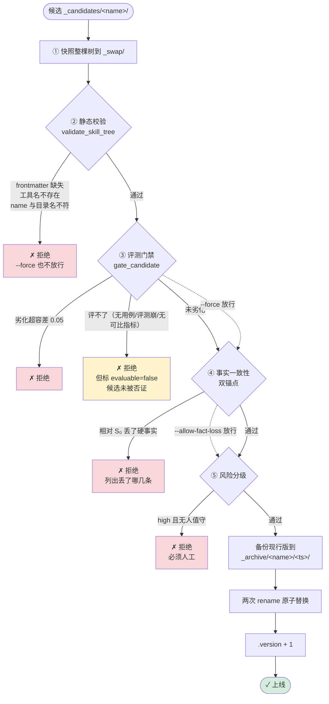

### 4.1 为什么先快照

原来是"读候选文本 → 校验 → 整树 copytree(耗时) → 再从磁盘重读候选目录"。
**校验过的字节与最终装上线的字节之间隔着一整段可写窗口** —— 而
`POST /api/admin/skills/upload` 能从网页并发替换那个候选目录。

先把候选整棵树快照下来,**校验、判档、安装全部只认这一份快照**,TOCTOU 就在
构造上消失了。

### 4.2 门禁:fail-closed,而且要分清"评不了"和"评了没过"

`gate_candidate()` 在**影子目录**里跑两轮真实评测:正式技能集全量复制一份,
再用候选覆盖目标 skill —— 这样评的是"只换了这一个 skill"的完整技能集。

比三个均值(`pass_rate` / `avg_process_score` / `avg_result_score`),
掉点超过 `skill_gate_tolerance=0.05` 即判劣化。

**三种情况都是 `promote=False`,但含义完全不同:**

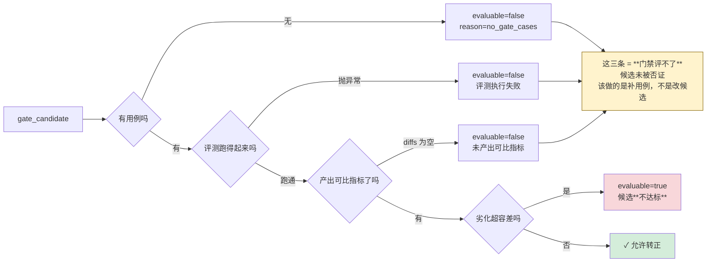

**混成一条会让人去修一个完全没有问题的候选。** 所以 `gate_candidate` 返回
`evaluable` / `underpowered` / `case_count` 三个证据元数据,看门狗据此打不同的
标签(`gate_unavailable` vs `gate_failed`),界面据此渲染不同的文案。

`underpowered`(用例 < `MIN_TRUSTWORTHY_CASES=3`)是另一层披露:门禁跑得动,
但结论是噪声级的。`tolerance=0.05` 对 n=1 意味着"只要候选没把唯一那条用例
从过弄成不过就算未劣化",而一次随机波动也能凭空判出劣化。它仍然输出
`promote=True` —— 读起来像"过了评测",实际证据强度接近零,所以那句话必须
**贴在结论上**。

### 4.3 死结,以及它是怎么断开的

新建 skill 走 `gate_then_watch`,而这条路要求先过离线门禁:

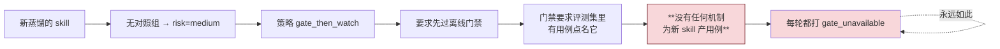

实测:`draft-outreach-campaign`、`daily-business-report`、`refund-attribution`、
`product-health-check` 四个**现行** skill 的门禁用例数全是 **0** —— 它们连
"改进后转正"都走不通。

**`case_synthesis.py` 从真实会话合成用例,断开了这个环。** 关键在于:
一次 LLM 都不调,每项断言都有事实来源。

| 断言项 | 事实来源 |
|---|---|
| `turns` | 买家在那一轮说的原话(归档会话,逐字) |
| `expected_tools` | 那一轮实际调用过的工具(assistant 消息的 `tool_calls`) |
| `expected_keywords` | 人工坐席回复里的已知词(`keywords_from_reply`,确定性词表) |
| `related_skills` | `[skill_name]` |

> 方案原稿写的是"每条会话 → LLM 抽成 EvalCase"。真动手时发现不需要 ——
> 把"模型不决定正确答案"这条纪律推到底,**模型连格式也不必整理**。
> 一条门禁用例是要被当作**裁判尺**用的,它自己必须先是确定的。

两个采样源,强弱不同,分别报数:

- `SOURCE_TRACE`(强):`skill_traces` 里这个 skill **确实执行过**的轮次;
- `SOURCE_KEYWORD`(弱):按 skill 自己 frontmatter 声明的关键词去归档会话里捞。
  **新蒸馏的候选一条轨迹都没有** —— 只有轨迹这一个源的话,死结对"全新 skill"
  这个最需要它的场景根本没解开。

关键词只决定**挑哪些真实会话**,不参与任何一条断言。这是整个阶段的安全边界:
**采样可以启发式,裁判尺不能。**

三条纪律都落到了代码上:

1. **与人工集物理分开**(`cases_synth/`,不进 `cases.json`)。后者同时是回归基线的
   采样集,混入未审用例会让基线随自动合成漂移,而且**没有任何报错**。有仓库级
   测试钉死。
2. **分别报数**。`gate_readiness()` 给 `human_count` / `synthetic_count`,
   API 与界面各给一行「其中 N 条自动合成 · 未经人工审核」。只报总数是自动化
   最容易骗到人的地方。
3. **id 以 `synth-` 开头** —— 拿得到 `case_id` 的任何下游(报告/日志/界面)
   不查文件也能判断这条没有人审过。

### 4.4 事实一致性双锚点

多轮自我改进最阴的一种退化:**每一轮只删一点,轮轮都"看起来没问题"**,
十轮之后「超过 7 天不支持退货」已经不见了,而没有任何一次转正被拦下来 ——
因为每次都只和上一版比。

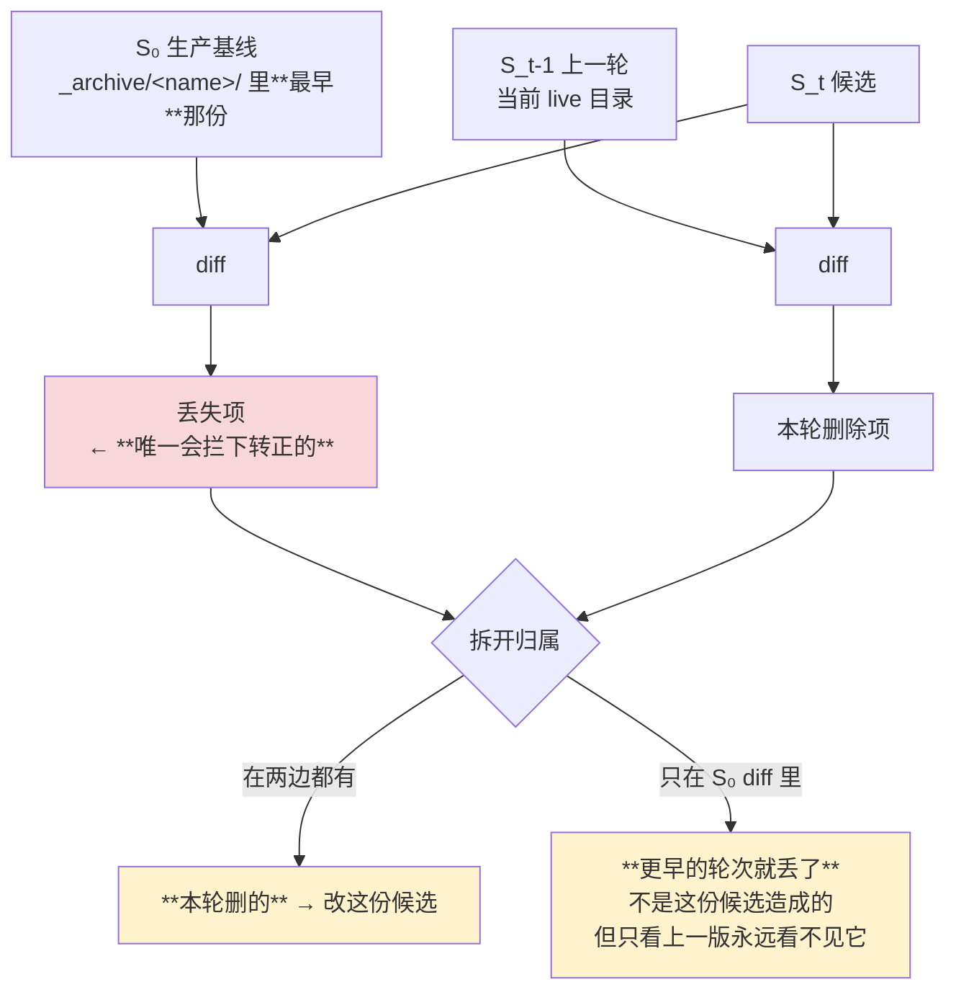

- 只拿 `S_{t-1}` 比 → 每轮的删除都只有一点点,**永远拦不住累积**;
- 只拿 `S₀` 比 → 分不清是本轮删的还是上一轮就没了,**修复方向是模糊的**。

**"事实"只认两类**,都精确、都真的危险:

1. **带单位的数值** —— `7天`、`¥15`、`50%`、`15个工作日`。政策数字是 SKILL.md 里
   最不能丢的东西:客服照着它对用户做承诺。
2. **反引号里的工具名** —— 丢一个通常意味着流程丢了一步。

不认散文、不认关键词、不做语义比对。**这是一道会拦下转正的闸,它自己不能是
概率性的。** 取向与别处相反:宁可漏判,不可误判 —— 一道会误伤的闸,人第二次
就开始绕过去,于是它对真正的事实丢失也一起失效了。

膨胀率(相对 S₀ 的行数增长)**只报不拦**:论文无治理时 Bloat 是 16.2%,
但本项目 skill 是单文件,几百行的文档涨 20% 并不必然是坏事。

> **放行开关是独立的 `--allow-fact-loss`,没有挂在 `--force` 上。**
> 差点做错这一处:界面上的「转正上线」按钮**永远**带 `force=true`
> (它默认不跑门禁,后端对 `gate=None` 是 fail-closed 的)。挂上去的话,
> 这道闸在人最常走的那条路上从来不生效 —— **一道只在 CLI 上有效的闸不叫闸。**
> 语义也更准:放行门禁是"我知道没测过",放行事实丢失是"我知道我在删哪几条硬事实"。

### 4.5 风险分级:决定"谁有权放行"

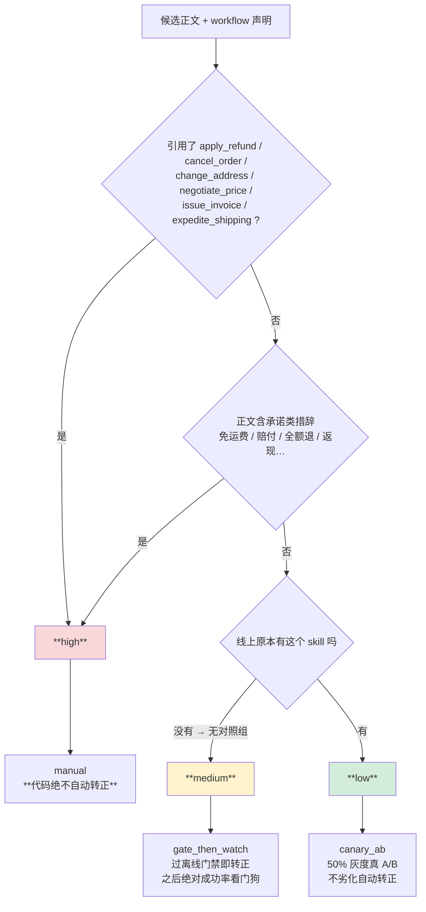

三处细节:

- **判档看整棵树,不只看根 SKILL.md**。候选带的 `references/*.md` 会随转正一起
  上线并被灌进模型上下文 —— 只看根文件会让"人畜无害的正文 + 附件里写着直接
  全额退款"这种候选被判低危、走完全自动的灰度转正。
- **工具集要并上 workflow 声明侧**。`guards` 正是本项目给高危流程用的惯用写法;
  只扫正文的话,一个把 `apply_refund` 只写在 guards 里的退款候选会被判成低危。
  这是安全分级里**最危险的漏判方向**。
- **未知档位一律按 manual**(fail-closed)。`risk=None` 表示"判不了",
  在界面上必须渲染成"需人工复核",绝不能渲染成"低危"。

---

## 5. 上线之后:灰度与看门狗

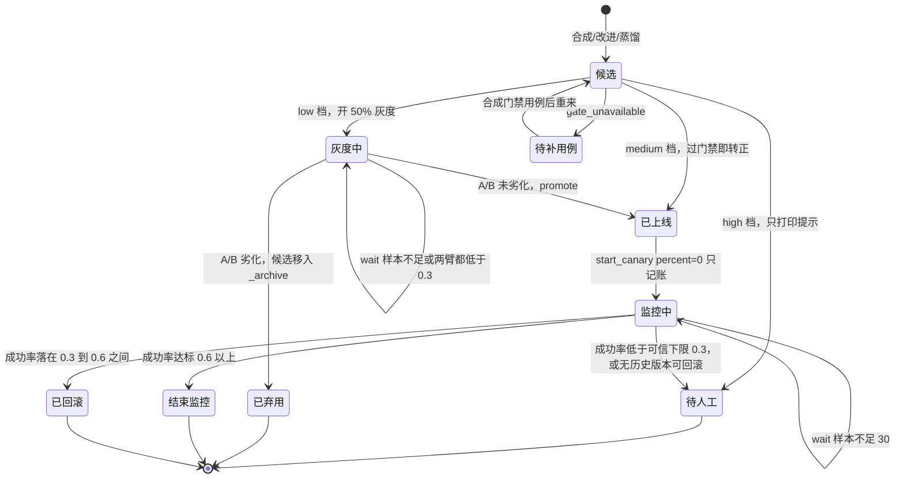

### 5.1 两种判据

| | `evaluate_ab`(low 档) | `evaluate_absolute`(medium 档) |
|---|---|---|
| 适用 | 改进型,**有对照组** | 新建型,**无对照组** |
| 判据 | `canary_rate < live_rate - 0.1` → 回滚 | `rate < 0.6` → 回滚 |
| 最小样本 | 灰度 10 且对照 10 | 30 |
| 可信下限 | 两臂都 < 0.3 → **wait** | < 0.3 → **wait** |

### 5.2 `AB_SANITY_FLOOR = 0.3` 是怎么来的

A/B 只问"有没有比现行版更差",**从不问"够不够好"**。现行版被基础设施故障
压塌时,`canary_rate < live_rate - max_drop` 会变成一个永远不成立的条件 ——
`live=0.03` 时它等价于 `canary_rate < -0.07`,于是**任何候选都自动转正**。

实测撞到过:`track-order` 因为 MCP 数据源被代理打断,实战成功率 3%
(success:1 · tool_error:37),而候选池里正好躺着一份它的改进候选 ——
**那份候选本可以在这种基线下无条件上线。**

绝对值那条路径原来更糟:同一个依赖故障会把一份正常的 skill 直接回滚掉,
理由写成"成功率 0.27 低于下限 0.6" —— 读起来是 skill 质量问题。而那 0.27 的真相是:

- 51 条轨迹里 36 条来自合成用户(`ab*` 压测 / `ev*` 评测 / `trk*`),真实买家只有 15 条;
- 36/37 条失败是同一个订单号 —— **评测数据集里那个**;
- 37 条 `tool_error` 里有 11 条其实兜底成功了,而 track-order 的描述里明写着
  "支持订单号不存在时的友好兜底" —— **它正因为有兜底而被扣分**。

所以低于下限时判 `wait` 而不是 `rollback`:**停下来去查,而不是先把候选毁掉。**
回滚不可白做 —— 它会把线上换成上一版并结束灰度。

`0.3 ≤ rate < 0.6` 这一段仍然回滚:那是"确实不达标但数字还讲得通"的区间。

### 5.3 收口铁律

> **只有动作真的成功了才关闭灰度记录。**

动作失败(如新建 skill 绩效不达标却无历史版本可回滚)必须保持灰度为活跃并
明确升级人工 —— 否则**差劲的 skill 会永久留在线上,而库里却记着"已回滚",
监控就此静默停止**。

对应到代码里就是那个 `rollback_failed_manual_required`,它和
`promote_blocked_risk_changed`、`gate_unavailable` 一起进 `NEEDS_HUMAN_ACTIONS`,
让 cron 以非零码退出去告警。

`gate_unavailable` 在列而 `gate_failed` **不在**,这个不对称是刻意的:
门禁**评了**并判候选不达标,属于自动化正常收尾(候选该弃用,没人需要做什么);
门禁**评不了**则是卡死状态 —— 不补用例、不人工放行,它下一轮、下一百轮都是
同一行,而退出码一直是 0 会让 cron 把"这个 skill 永远无法转正"当成普通成功。

---

## 6. Generator ≠ Evaluator

论文把这条列为**唯一的架构性硬要求**。改造前本仓库三处全是 `settings.model_name`:

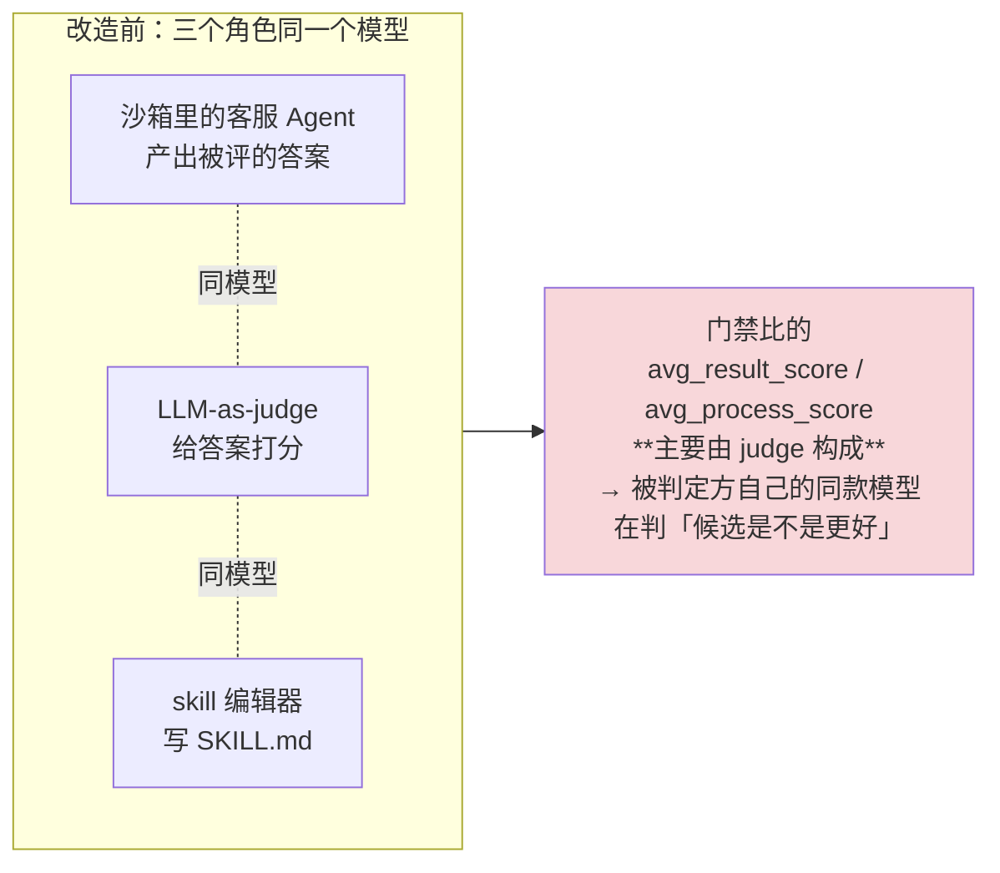

现在 `app/evaluation/independence.py` 统一三个角色的模型选择,四处接上:
门禁 `default_eval_fn`、前端一键跑 `run_service`、CLI `run_eval`、编辑器
`synthesize_skills`。

**注意换的是裁判,不是被评对象** —— `Evaluator` 的 `client`/`model` 只喂 judge,
沙箱里的 Agent 必须仍走线上模型,换错了就等于在评一个不存在的线上行为。

`settings` 默认留空 = 沿用主模型,**行为逐字节不变**。硬把默认改成某个模型名会让
所有没配那个端点的部署第一次跑门禁就 404 —— 那是把一条架构建议变成一次线上故障。
取而代之:**此刻是不是自审,写进评测摘要、门禁 reason、CLI 报告抬头。**

> 一个不知道自己在自审的 81 分,比一个标着"自审"的 81 分危险得多。

本部署已配成真独立(`.env` 里 `EVAL_JUDGE_MODEL=deepseek-v3`,与 `qwen-plus`
不同族,同一个 DashScope 端点,不需要第二个端点)。

---

## 7. 文件布局

```
app/agent/skills/definitions/
├── track-order/              ← 正式技能，**唯一会被加载的层级**
│   ├── SKILL.md
│   ├── .version              ← 转正/回滚时 +1
│   └── references/           ← 可选附件，随转正一起上线
├── process-return/
│   ├── SKILL.md
│   └── ...
│
├── _candidates/              ← 待审候选（深一层 → _discover 扫不到）
│   └── order-query/SKILL.md
├── _archive/                 ← 转正前自动备份（S₀ 就在这里取）
│   └── track-order/
│       ├── 20260804-232032/SKILL.md   ← 最早那份 = 生产基线 S₀
│       ├── 20260804-232108/SKILL.md
│       └── 20260810-223152/SKILL.md
├── _shadow/                  ← 门禁临时影子技能集
├── _swap/                    ← 转正中转（两次 rename 的落脚点）
├── _promoted/ _rejected/     ← 处理完的候选归档（**不删**）

app/evaluation/
├── cases.json                ← 人工回归集 = 基线采样集
├── cases_synth/<skill>.json  ← **自动合成，未经人工审核**，只用于门禁
└── baseline.json
```

`_shadow` / `_swap` 之所以安全,靠的是**深度**而不是 `_` 前缀 ——
`_discover` 并没有按前缀过滤。而 `build_shadow_dir` 与 `list_candidates` 靠的是
`_` 前缀。**两处靠的性质不同,改任一处前先确认另一处仍成立。**

---

## 8. 贯穿全流程的取舍

| 位置 | 方向 | 理由 |
|---|---|---|
| 轨迹埋点 | **fail-soft** | 埋点绝不能影响回话 |
| workflow 守卫声明有问题 | **fail-open** | 守卫是为了拦跳步,不是制造新故障点 |
| 语义聚类不可用 | **fail-soft** 回落关键词 | 自进化是离线增强,不该因为向量挂了整个跑不动 |
| 合成用例文件坏了 | **fail-soft** | 增量能力,坏了退回"只有人工用例",不能连人工用例也跑不了 |
| 归因判不出 | **不回流** | 不知道 ≠ 该改 |
| **评测门禁** | **fail-closed** | 不能证明更好,就不许上 |
| **未知风险档** | **fail-closed**(按 manual) | 判不了 ≠ 低危 |
| **事实一致性** | **fail-closed** | 硬事实丢了就是丢了 |
| **收口记账** | **fail-closed** | 动作没成功就不许关灰度 |

还有一条贯穿始终、不属于 fail-open/closed 二分的:

> **每一处"自动产生的东西"都要在界面上标明来源。**
> 合成的门禁用例写「未经人工审核」,归因结论写「规则判定还是模型判定」,
> 正文读不全写「不是全部内容」,自审写「这些分数是自评」。
>
> 这是本仓库一贯的纪律(`anomaly_scope`、`degraded`、`data_scope`、
> `service_insufficient` 都是这个形状):**把"这是什么"说清楚,
> 比把数字做好看更重要。**

---

## 9. 实测现状(2026-08-16,真实库)

**技能集**:7 个现行(**3 买家侧** `track-order`/`process-return`/`product-recommend`
+ **4 卖家侧** `daily-business-report`/`draft-outreach-campaign`/`product-health-check`/`refund-attribution`)、
6 个待审候选、0 个活跃灰度。

**轨迹**(全时段聚合,976 行):

| skill | success | tool_error | 成功率 |
|---|---|---|---|
| process-return | 763 | 6 | 99% |
| product-recommend | 153 | 0 | 100% |
| track-order | 15 | 38 | **28%** |
| daily-business-report | 1 | 0 | 100% |

> track-order 那 28% 是**归属校验在正确工作**,不是 skill 写坏了 ——
> 见 §3.2。界面上这一行旁边就跟着归因,写着「无一条指向 skill 本身,
> 改流程文档解决不了这些失败」。

**门禁用例**(合成前 → 合成后):

```
order-query                   0 → 5    evaluable: false → true
return-and-exchange-handling  0 → 5    evaluable: false → true
query-coupons                 0 → 3    evaluable: false → true
track-order                   1 → 6    （人工 1 + 合成 5，其中 3 条来自真实轨迹）
process-return                1 → 6
product-recommend             1 → 2
daily-business-report         0 → 0    ← 卖家侧，只能走轨迹路，当前无轨迹
draft-outreach-campaign       0 → 0    ← 同上
product-health-check          0 → 0    ← 同上
refund-attribution            0 → 0    ← 同上（这一条曾经错误地产出过 5 条，见 §11 ⑦）
ticket-handling               0 → 0    ← 关键词一条会话都没命中
track-order-not-found         0 → 0    ← 命中的那一轮断不出任何期望
```

**一次真实门禁**(`query-coupons`,候选 vs 现行,两侧各真调 LLM):

```
evaluable = True   case_count = 3   underpowered = False
58 s / 47.5k tokens
avg_process_score  现行 0.733 → 候选 0.467
判定：候选劣化超过容差，拒绝转正
裁判独立性：Agent=qwen-plus / 裁判=deepseek-v3 / 编辑器=qwen-plus
```

**门禁不但跑起来了,而且给出了拒绝** —— 这比"跑通了并放行"更能说明它在工作:
它现在有能力基于证据说不,而不是说"我评不了"。

---

## 10. 亲手跑一遍

```bash
python -m app.scripts.synthesize_skills --limit 50
```
① 聚类合成 ②b 金牌语料蒸馏 ③ 失败自改进(带归因过滤)。产物只落 `_candidates/`。

```bash
python -m app.scripts.synth_gate_cases --all --dry-run
```
看会为每个 skill 合成出什么门禁用例,不落盘。去掉 `--dry-run` 才写。

```bash
python -m app.scripts.promote_skill --list
```
列出候选与校验结果。

```bash
python -m app.scripts.skill_watchdog --start-all
```
按风险档为每个候选开灰度 / 走门禁。**用例为 0 时会先自动合成一批再决定要不要
花钱跑评测** —— 这就是死结断开的地方。

```bash
python -m app.scripts.skill_watchdog --check
```
评估活跃灰度并自动收口:转正 / 回滚 / 继续观察。需人工时以非零码退出。

```bash
python -m app.scripts.promote_skill track-order --rollback
```
回滚到最近一次备份。

管理端 `Skill 管理` 页(`候选 / 灰度 / 转正`)覆盖了上面除 `synthesize_skills`
之外的全部动作,并且每张卡片都能**点开看正文** —— 那是决定客服说什么的东西,
不该只能登服务器 `cat`。

---

## 11. 已知边界

**① 合成用例的 `expected_tools` 是"那次发生了什么",不等于"必须这么做"。**
`query-coupons` 的合成用例里,「你好,请问优惠券在哪里领」断言必须调用
`query_coupons`,而回答"在「我的」→「优惠券」页面领"其实不调工具也说得通。
后果是那次门禁两侧 `pass_rate` 都是 0 —— **门禁仍然有效**(比的是同一批用例上的
差值,严格用例对两侧一样严格),但 `pass_rate` 这个指标在这批用例上不出信号。

**② 卖家侧 skill 合成不出用例。** 归档语料目前只有买家会话。CLI 会把这个理由
打出来,不是一句光秃秃的「0 条」。

**③ 新蒸馏 skill 的用例仍靠关键词采样(弱证据)。** 候选目录里没有记录
"这个 skill 是从哪些会话蒸馏出来的"。要把这一路也变成强证据,得在
`synthesize_skills` 产出候选时把来源 `session_id` 一并落下来。

**④ 归因的语义合并没做。** 论文用 Jaccard 0.3 把指向同一缺口的多个失败合成
一条信号,本项目 `clustering.py` 有这个能力但没接上 —— 当前是按会话逐条归因。
语料量级(44 条)还没到需要合并的程度。

**⑤ 评测是单轮的。** 评测集 10 条里只有 1 条多轮。论文最有说服力的案例是
"Agent 第一轮就说反了规则,但用户没放弃,因为答案看起来自洽" ——
**错误的知识比缺失的知识更具欺骗性**,而这恰恰是单轮 QA 几乎不可能触发的失败模式。
多轮用户模拟(方案阶段三)是收益最大的一步,尚未做,卡在配额口径:
估算约 2500 次调用,而 `collab_daily_llm_budget` 只有 200。

**⑥ 结构治理暂缓。** 论文的引用断裂、孤儿文件检测针对多文件技能树,
而本项目 skill 目前**全是单文件**,那类退化在结构上还不成立。等出现
`references/` 多文件结构,或 Bloat 超过 15% 再做。

**⑦ 关键词路曾经跨过 actor 边界(写本文时发现并已修)。**
`refund-attribution` 是**店铺参谋**的「退款率为什么升高」分析技能,而它声明的
关键词是「退款、退货、售后」—— 与买家话题高度重叠。`session_archive` 里目前
只有买家会话,于是它捞到了 5 条「我要退货,订单号 ORD-…」,断言 `query_order`。

**那不是弱证据,是错的。** 门禁会拿买家提问去评一个参谋技能,而那些用例跑在
买家沙箱里,这个卖家 skill 根本不会被加载 —— **一条错的裁判尺比没有更糟**。

修法:卖家侧 skill **只走轨迹路**(轨迹记着"这个 skill 确实在那一轮跑过",
actor 由事实保证),关键词路禁用并把理由报出来。落盘文件也加了仓库级不变量测试,
防止"改了代码但没重新生成"的残留。

> 这条和 §3.1 那句"采样可以启发式,裁判尺不能"是同一个道理的两面:
> 启发式采样的**边界**本身必须是硬的。

---

## 附:相关文档

- `docs/SkillEvo借鉴技术方案.md` —— 论文借鉴方案与执行记录(含实测数字与未做部分)
- `docs/多智能体协作技术文档.md` —— 另一条链路:薄编排 / 事件订阅 / 人工闸
- `docs/交付对照表.md` —— 逐条交付项与验收
